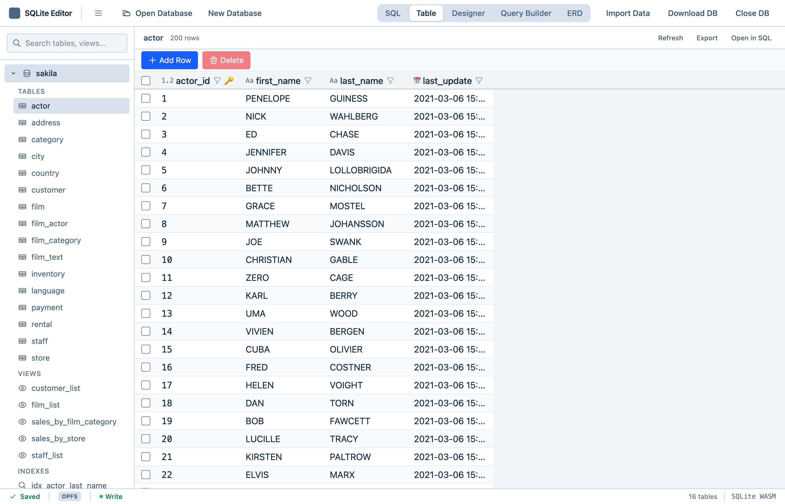
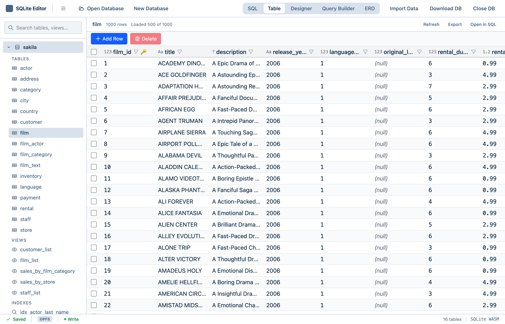
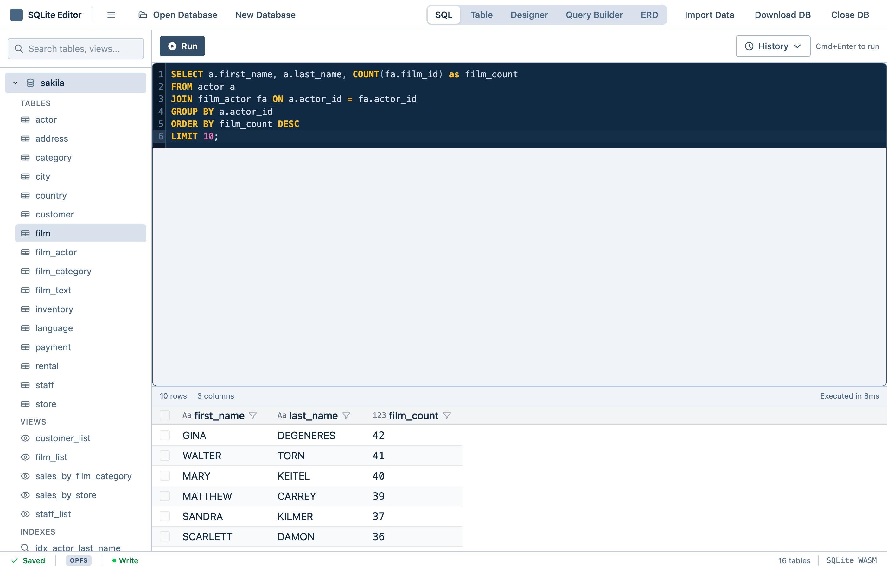
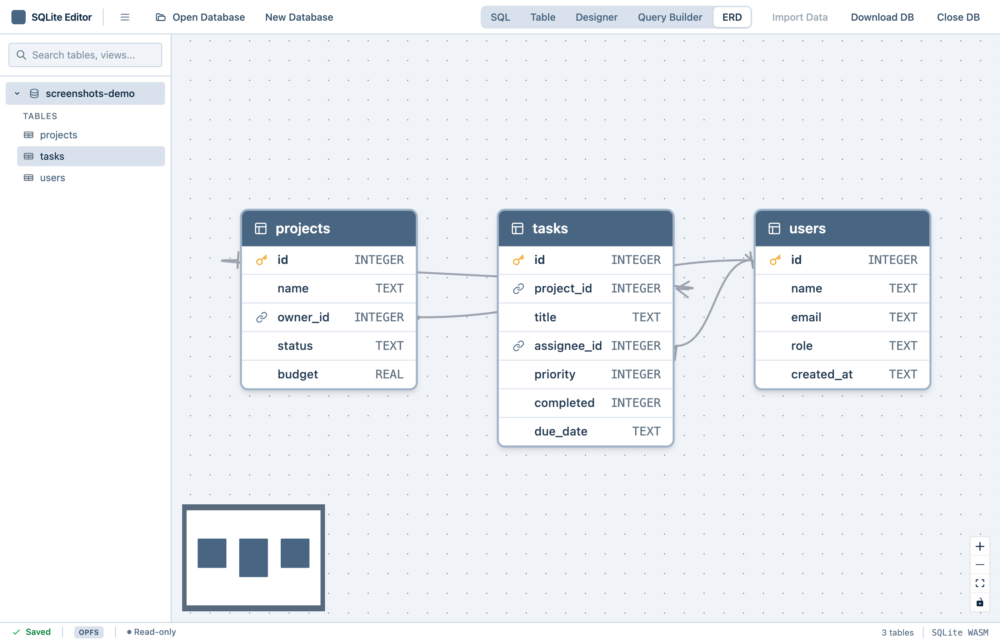
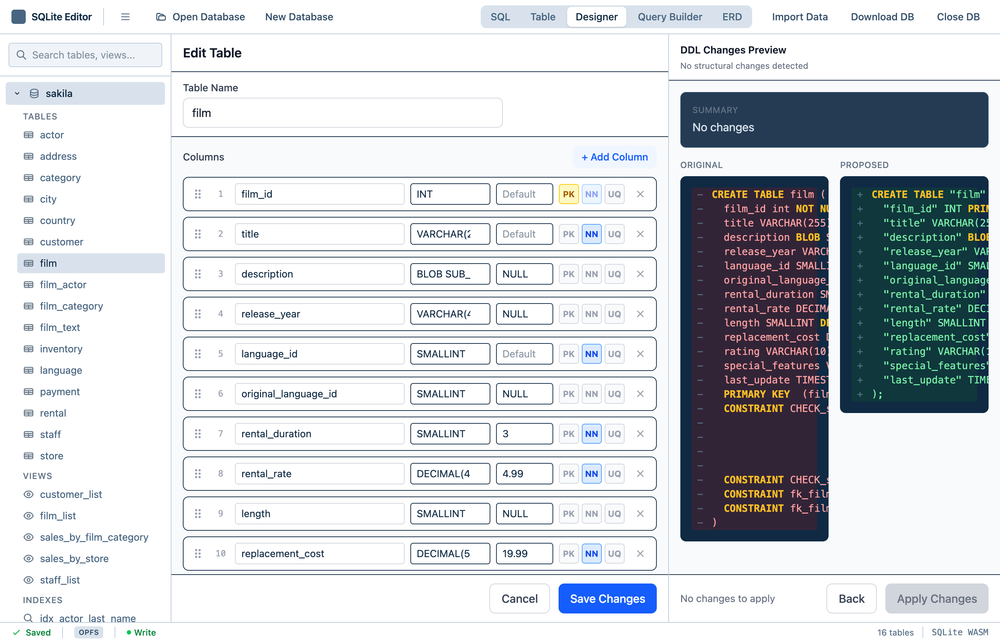
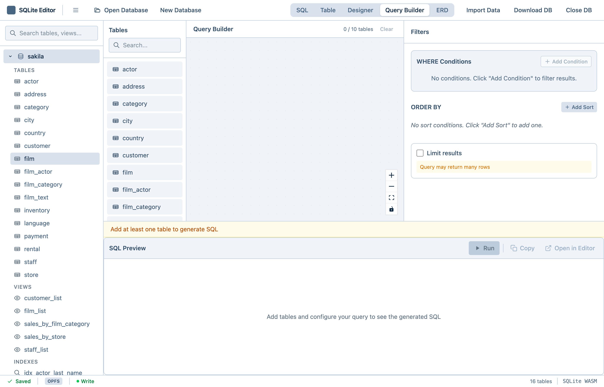

# SQLocal - Local SQLite Browser Editor

Offline SQLite editor in your browser. Visual table designer, ERD diagrams, SQL editor with autocomplete. No server needed.

**100% browser-based, powered by WASM. Private. Open source.**

**Try it now:** If you just want to use the editor, a hosted version is available at [https://botifyr.com/sqlocal-browser-sqlite-editor/](https://botifyr.com/sqlocal-browser-sqlite-editor/)

[](https://github.com/felix-huber/browser-sqlite-editor/actions/workflows/build.yml)
[](https://github.com/felix-huber/browser-sqlite-editor/actions/workflows/test.yml)
[](https://github.com/felix-huber/browser-sqlite-editor/actions/workflows/lint.yml)
[](https://github.com/felix-huber/browser-sqlite-editor/actions/workflows/typecheck.yml)
[](LICENSE)
[](https://web.dev/progressive-web-apps/)

## Features

- **Visual Table Designer** - Create and modify tables with drag-and-drop column reordering
- **ERD Relationship Editor** - Visually connect foreign keys in an Access-style diagram
- **SQL Editor** - Syntax highlighting, autocomplete, and query history
- **Data Grid** - Virtual scrolling, inline editing, sorting, and filtering
- **Query Builder** - Build queries visually with JOIN support
- **Sample Database** - Load the Sakila sample database to explore features
- **Import/Export** - Load `.sqlite`/`.db` files, import CSV/JSON, export databases and query results
- **Multi-Tab Support** - Open the same database in multiple tabs with single-writer/multi-reader locking
- **Offline Support** - PWA with service worker for full offline functionality
- **Zero Server** - Runs entirely in your browser with no backend required



## Installation

### PWA Install (Recommended)

1. Open the app in Chrome, Edge, or Firefox
2. Click the install icon in the address bar (or use the browser menu)
3. The app will install and can be launched from your desktop/apps

### From Source

```bash
git clone https://github.com/felix-huber/browser-sqlite-editor.git
cd browser-sqlite-editor
npm install
npm run dev
```

## Quick Start

### Create a New Database

1. Click **New Database** or press `Cmd/Ctrl+N`
2. Enter a name for your database
3. Start creating tables in the Table Designer

### Import an Existing SQLite File

1. Drag and drop a `.sqlite` or `.db` file onto the app
2. Or click **Open Database** (`Cmd/Ctrl+O`) to use the file picker
3. Your database will be loaded and persisted locally

### Run Queries

1. Select **SQL Editor** from the sidebar
2. Write your SQL query
3. Press `Cmd/Ctrl+Enter` to execute
4. View results in the data grid below

## Screenshots

| Data Grid | SQL Editor |
|-----------|------------|
|  |  |

| ERD Diagram | Table Designer |
|-------------|----------------|
|  |  |

| Query Builder |
|---------------|
|  |

## Keyboard Shortcuts

### Global

| Shortcut | Action |
|----------|--------|
| `Cmd/Ctrl+O` | Open database file |
| `Cmd/Ctrl+N` | New database |
| `Cmd/Ctrl+S` | Save changes |
| `Cmd/Ctrl+W` | Close database |
| `Cmd/Ctrl+,` | Open settings |

### SQL Editor

| Shortcut | Action |
|----------|--------|
| `Cmd/Ctrl+Enter` | Execute query |
| `Cmd/Ctrl+Shift+Enter` | Execute and explain |
| `Escape` | Cancel query |

### Data Grid

| Shortcut | Action |
|----------|--------|
| `Enter` | Edit selected cell |
| `Escape` | Cancel edit |
| `Delete/Backspace` | Clear cell or delete row |
| `Cmd/Ctrl+C` | Copy cell value |
| `Arrow keys` | Navigate cells |

## Storage Architecture

### OPFS (Primary) vs IndexedDB (Fallback)

The app uses **OPFS (Origin Private File System)** as the primary storage mode for optimal performance. OPFS provides native file system access with synchronous I/O, which SQLite requires for proper operation. Browsers without OPFS support automatically fall back to IndexedDB.

| Browser | Storage Mode | Notes |
|---------|--------------|-------|
| Chrome 86+ | OPFS | Full support with native file system |
| Edge 86+ | OPFS | Full support with native file system |
| Firefox 111+ | OPFS | Full support with native file system |
| Safari 15.2+ | IndexedDB | Fallback storage, slightly slower |

### OPFS Layout

Databases are stored in the Origin Private File System under:
```
/wasm-sqlite-editor/
  registry.json           # Database metadata registry
  databases/
    my_database.sqlite    # Database files
    my_database.erd.json  # ERD layout sidecar files
```

**Legacy Migration**: If you have databases from an older version stored in `/sqlite-editor/`, they will be automatically migrated to the new layout on first load.

### Multi-Tab Locking

When opening a database, the app uses the **Web Locks API** to ensure single-writer/multi-reader access:

- **First tab to open a database** acquires an exclusive write lock
- **Subsequent tabs** open the database in **read-only mode** and see a banner indicating another tab holds the write lock
- When the writer tab closes the database, another tab can acquire the lock
- **Fallback**: Safari (<16.4) and older browsers use a localStorage heartbeat mechanism

This prevents data corruption from concurrent writes while still allowing you to view the database in multiple tabs.

## Privacy

**All data stays in your browser.** SQLocal:

- Stores databases locally using OPFS or IndexedDB
- Makes no external network calls after initial load
- Collects no telemetry or analytics
- Requires no account or sign-up

Your data never leaves your device.

## Development

```bash
# Install dependencies
npm install

# Start dev server
npm run dev

# Run tests
npm test

# Run E2E tests
npm run test:e2e

# Type check
npm run typecheck

# Lint
npm run lint

# Build for production
npm run build

# Preview production build
npm run preview

# Check bundle size
npm run size
```

### Tech Stack

- **React 18** + TypeScript
- **Tailwind CSS** for styling
- **wa-sqlite** (SQLite compiled to WebAssembly)
- **TanStack Table** + Virtual for data grid
- **CodeMirror 6** for SQL editor
- **React Flow** for ERD visualization
- **Vite** + PWA plugin

## Self-Hosting / Local Development

### Cross-Origin Headers Required

The app uses OPFS (Origin Private File System) with synchronous file access for optimal WASM SQLite performance. This requires **cross-origin isolation**, which is enabled by serving the app with these HTTP headers:

```
Cross-Origin-Embedder-Policy: require-corp
Cross-Origin-Opener-Policy: same-origin
```

Without these headers, the app will fall back to IndexedDB storage (slower but functional).

### Running the Production Build Locally

**Option 1: Use the built-in preview server (recommended)**

```bash
npm run build
npm run preview
```

The Vite preview server is pre-configured with the required headers.

**Option 2: Nginx configuration**

```nginx
server {
    listen 8080;
    root /path/to/dist;
    index index.html;

    add_header Cross-Origin-Embedder-Policy "require-corp" always;
    add_header Cross-Origin-Opener-Policy "same-origin" always;

    location / {
        try_files $uri $uri/ /index.html;
    }
}
```

**Option 3: Python with custom headers**

```python
from http.server import HTTPServer, SimpleHTTPRequestHandler

class COOPCOEPHandler(SimpleHTTPRequestHandler):
    def end_headers(self):
        self.send_header('Cross-Origin-Embedder-Policy', 'require-corp')
        self.send_header('Cross-Origin-Opener-Policy', 'same-origin')
        super().end_headers()

HTTPServer(('localhost', 8080), COOPCOEPHandler).serve_forever()
```

### Subdirectory Deployment

To deploy the app under a subdirectory (e.g., `https://example.com/myapp/`), set the `VITE_BASE` environment variable during build:

```bash
VITE_BASE=/myapp/ npm run build
```

### Why These Headers Are Needed

OPFS provides synchronous file access APIs (`FileSystemSyncAccessHandle`) which are only available in cross-origin isolated contexts. The WASM SQLite engine uses these APIs for direct, high-performance file I/O. Cross-origin isolation is enabled when both COOP and COEP headers are set correctly, which restricts the page from loading cross-origin resources unless they explicitly opt-in via CORS.

## License

MIT License - see [LICENSE](LICENSE) for details.
