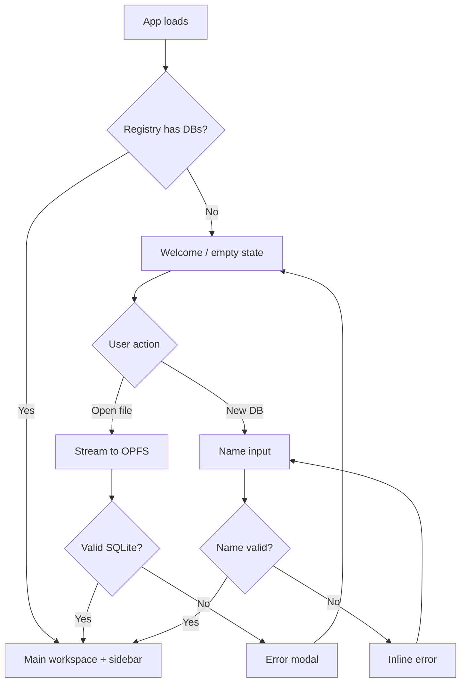
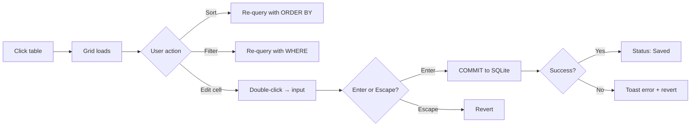
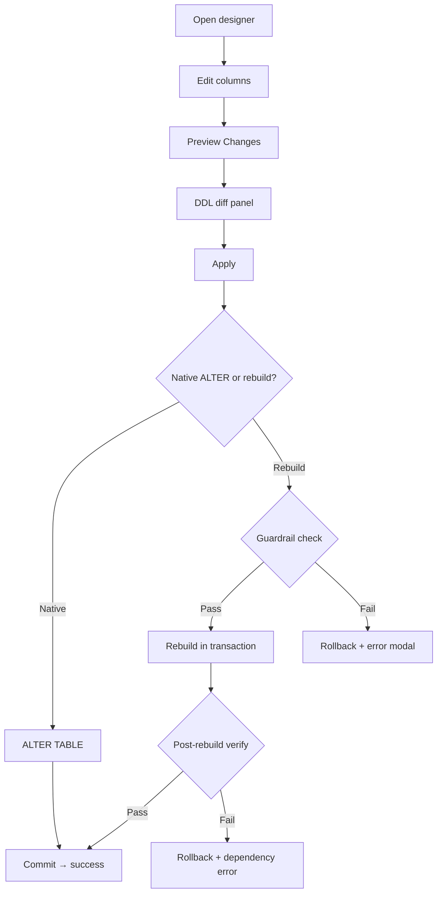
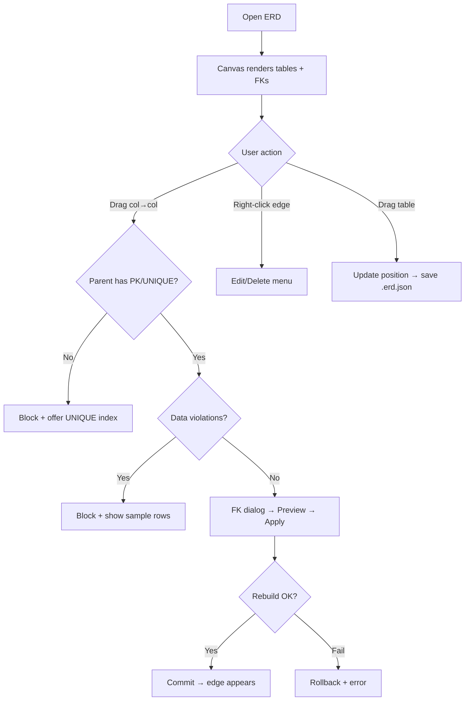
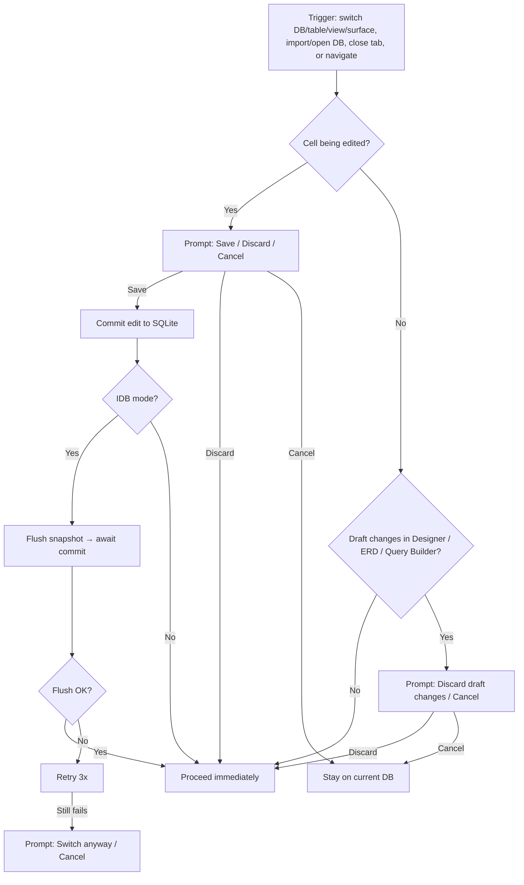

# 02 — UX Spec (Flows + State)

## Design Direction

### Principles
1. **Direct manipulation** — Edit data and schema in-place; minimize modal dialogs. Double-click to edit, drag to connect, right-click for context actions.
2. **Transparent persistence** — The user never "saves." OPFS VFS makes writes durable on commit. Status bar confirms state ("Saved" / "Unsaved") without requiring user action.
3. **Progressive disclosure** — Show the essential (grid, sidebar, editor) immediately. Surface power features (DDL diff, query builder, ERD) through clear entry points, not cluttered defaults.
4. **Fail safe, fail loud** — Destructive operations require confirmation **except in the SQL editor (power-user mode)**. Transactional rollback protects data. Errors name the problem and suggest recovery.
5. **Desktop-first, keyboard-friendly** — Optimized for mouse+keyboard on 1280px+ screens. Core workflows (run query, navigate tables, edit cells) are keyboard-driven.

**Terminology**: Use **IndexedDB fallback** in all user-facing copy and headings. **IDB** may be used as an internal abbreviation in code/comments, but should not appear in UI strings.

## Screen Inventory

| Screen | Purpose | Entry Points |
|--------|---------|--------------|
| **Welcome / Empty state** | First visit or no DBs | App load with empty registry |
| **Main workspace** | Primary three-panel layout | After opening/creating a DB; toolbar includes "Open Database" + "New Database" |
| **Sidebar navigator** | Browse + search schema tree (DBs, tables, views, indexes) | Left panel in main workspace |
| **Data grid** | Browse + edit table rows | Click table in sidebar |
| **Table designer** | Create/edit table schema | "New Table" or "Design" from sidebar context menu |
| **ERD view** | Visualize + edit FK relationships | "Relationships" button in toolbar |
| **SQL editor** | Write + execute SQL | "SQL" tab in main area |
| **Query builder** | Visual query construction | "Query Builder" tab in main area |
| **Import dialog** | Import CSV/JSON | "Import" button or menu |
| **Export dialog** | Export DB/table/results | "Export" / "Download" buttons |
| **Settings** | Storage info, FK toggle, SQLite version | Gear icon in toolbar |

## Navigation Model

The **main area shows one surface at a time** (the sidebar remains visible unless collapsed on small widths):
- **Data Grid**: opens when a table/view is opened from the sidebar (views are read-only).
- **Table Designer**: opens from "New Table" or "Design" (sidebar context menu).
- **SQL Editor** and **Query Builder**: accessible via tabs in the main area; switching tabs does not change the selected table in the sidebar.
- **ERD View**: opened from the toolbar "Relationships" button; closing ERD returns the user to the previously active main-area surface.
- **Empty schema panel**: shown when the active DB has no tables (main area only).

Switching between surfaces (grid ↔ designer ↔ SQL ↔ query builder ↔ ERD) triggers the **Unsaved-Edit Check Flow** if there are in-progress edits or draft changes.

## PRD → UX Traceability

This table links PRD user stories to the UX flows/screens that implement them.

| PRD User Story | UX Flows | Primary Screens |
|---|---|---|
| **US-001 Load existing DB** | Flow 1, Flow 9, Flow 10 | Welcome, Main workspace, Sidebar navigator |
| **US-002 Create new DB** | Flow 1, Flow 9 | Welcome, Main workspace |
| **US-003 Visual table designer** | Flow 3, Flow 2B (Design entry) | Table designer |
| **US-004 Relationship editor (ERD)** | Flow 4 | ERD view |
| **US-005 SQL query editor** | Flow 5 | SQL editor |
| **US-006 Visual query builder** | Flow 6 | Query builder |
| **US-007 Data grid editing** | Flow 2C | Data grid |
| **US-008 Import CSV/JSON** | Flow 7 | Import dialog |
| **US-009 Export DB/table/results** | Flow 8 | Export dialog |
| **US-010 OPFS persistence + IDB fallback + multi-tab** | Flow 9, Flow 10 | Main workspace, Settings |
| **US-011 PWA / offline support** | Flow 11 | Settings, Main workspace |
| **US-012 Sidebar navigator** | Flow 2A, Flow 2B, Flow 9 | Sidebar navigator |
| **US-013 DB lifecycle (rename/delete/switch)** | Flow 9 | Sidebar navigator |

## Primary Flows

### Flow 1: First Visit — Open or Create a Database

**Trigger**: User navigates to the app for the first time (or with empty registry).

**Steps**:
1. App loads → WASM engine initializes in Web Worker → registry checked
2. Empty state shown: centered card with two CTAs — "Open Database" (file picker) and "New Database" (these actions are also available in the main workspace toolbar after the first DB is loaded)
3. **Path A — Open existing**:
   - User clicks "Open Database" or drags `.sqlite`/`.db` file onto the drop zone
   - Storage-mode behavior:
     - OPFS: File streamed (1MB chunks) into OPFS → DB opened via VFS
     - IndexedDB fallback: File loaded into an in-memory SQLite instance via `sqlite3_deserialize()` → initial snapshot persisted to IndexedDB (status: "Saving..." then "Saved")
   - Progress bar shown for files >5MB; size warning for >100MB (OPFS) or >50MB (IDB)
   - If name collision → auto-suffix with `(1)`
   - Sidebar populates with tables/views/indexes → first table auto-selected → data grid shown
4. **Path B — Create new**:
   - User clicks "New Database" → inline name input appears. Validation runs on blur and on submit; `Enter` submits and `Escape` cancels. Input is trimmed (leading/trailing whitespace removed).
   - On submit → empty DB created and persisted (OPFS: create in OPFS via VFS; IndexedDB fallback: create in-memory then snapshot to IndexedDB) → sidebar shows empty tree → main area shows an **Empty schema** panel: "No tables yet" with CTAs **New Table** (opens Table Designer) and **Import**
5. Sidebar collapses welcome state; three-panel workspace shown

**Success state**: Main workspace with sidebar showing DB schema, data grid or designer in main area.

**Error paths**:
- Invalid file → modal: "Not a valid SQLite file" / "File is encrypted — SQLCipher is not supported" → dismiss → back to welcome (**no DB is registered; any partial import artifacts are cleaned up**)
- Corrupt file → modal with error detail → dismiss (**no DB is registered; any partial import artifacts are cleaned up**)
- Unsupported file type (e.g., `.csv`, `.json`) dropped on the welcome screen → toast: "Unsupported file type. Use Import for CSV/JSON." → dismiss → stay on welcome
- OPFS unavailable → IndexedDB fallback banner at top of workspace

### Flow 2A: Navigate Schema via Sidebar (Search + Context Menu)

**Trigger**: User wants to find/open a table/view/index or switch databases.

**Steps**:
1. Sidebar shows the DB list. Only the **active DB** is expanded to show schema groups: **Tables / Views / Indexes**.
2. Sidebar search input filters within the **active DB** schema tree only (case-insensitive substring match).
   - Matching groups auto-expand; the matched substring is highlighted.
   - `Escape` clears the filter and restores the pre-filter expansion state.
3. Keyboard navigation (tree view):
   - Up/Down moves focus between visible items.
   - Right Arrow expands a collapsed node; Left Arrow collapses an expanded node.
   - Enter opens the focused table/view in the main area. If changing the main area surface would discard an in-progress grid edit or draft changes (Designer / ERD / Query Builder), run the **Unsaved-Edit Check Flow** first.
   - `Shift+F10` (or Context Menu key) opens the focused item's context menu; `Escape` closes it.
4. Multi-DB behavior:
   - Clicking/expanding a non-active DB triggers the **Unsaved-Edit Check Flow** and then switches the active DB (non-active DBs remain name-only until activated).
   - While switching, show a spinner next to the DB name and disable sidebar interactions until schema load completes.

**Success state**: Selected table/view opens (grid), or selected DB becomes active and its schema tree is shown.

**Error paths**:
- Schema load failure → toast: "Couldn't load schema." with action **Retry** (re-attempts schema load; stay on previous DB until it succeeds)

### Flow 2B: Rename or Drop a Table (Sidebar Context Menu)

**Trigger**: User right-clicks a **table** node in the sidebar and chooses **Rename** or **Drop**.

**Preconditions**:
- DB is active and **editable**. In **Read-only** or **Quota exceeded** modes, Rename/Drop actions are disabled with a tooltip explaining why.
- If any grid cell edit is in progress, or there are draft changes (Designer / ERD FK dialog / Query Builder), run the **Unsaved-Edit Check Flow** before proceeding.

**Steps (Rename)**:
1. Right-click table → **Rename**.
2. Inline input appears, pre-filled with current name. `Enter` submits, `Escape` cancels. Validation runs on blur and on submit.
3. Validate using **Table name** rules (see Validation & Copy Rules). If invalid/collision, show inline error and keep focus in the input.
4. On submit, execute `ALTER TABLE "<old>" RENAME TO "<new>"` in a transaction.
5. Update UI: sidebar label updates; if the grid/designer is currently showing this table, keep the user on the same surface and refresh headers/breadcrumbs. Update ERD layout metadata keys (`<db>.erd.json`) from `<old>` → `<new>` if present.
6. Toast: "Renamed table '<old>' → '<new>'."

**Steps (Drop)**:
1. Right-click table → **Drop**.
2. Confirmation dialog: **"Drop table '[name]'? All data will be lost."** Secondary copy: "This removes the table, its indexes, and its triggers."
3. Actions: **Drop** / **Cancel**.
4. On confirm, execute `DROP TABLE "<name>"` in a transaction.
5. Post-drop navigation: if the dropped table is currently open, auto-open the **next** table in sidebar order (next sibling; else previous). If no tables remain, show the **Empty schema** panel in the main area (same as new DB: "No tables yet" with CTAs **New Table** and **Import**).

**Success state**: Table is renamed or removed; sidebar and main area reflect the change.

**Error paths**:
- Rename collision → inline error: "A table named '[name]' already exists."
- Rename/Drop fails → modal: "Couldn't rename/drop table." Details: [SQLite error message]

### Flow 2C: Browse and Edit Table Data

**Trigger**: User clicks a table name in the sidebar.

**Pre-check**: If a grid cell edit is in progress or there are draft changes in the Table Designer / ERD FK dialog / Query Builder, run the **Unsaved-Edit Check Flow** before switching the main area to another table/view.

**Steps**:
1. Data grid loads with virtual scrolling → first window of rows fetched via SQL windowing (`LIMIT/OFFSET` by default; keyset pagination when sorting by `rowid` only).
2. Column headers show name + type → click header to sort (ASC → DESC → default). Sorting is stable: for non-unique sort columns, append a deterministic tie-breaker to prevent duplicate/missing rows across virtualized fetch windows:
   - Rowid tables: `ORDER BY <sort_col>, rowid`
   - WITHOUT ROWID tables: `ORDER BY <sort_col>, <pk_col_1>, <pk_col_2>, ...` (PRIMARY KEY columns in PK order)
   Default order is stable (rowid order for rowid tables; PRIMARY KEY order for WITHOUT ROWID tables).
3. Filter icon in each header → popover with filter type (text contains, numeric range, NULL/NOT NULL). Filters are SQL-backed; **"text contains"** is case-insensitive and deterministic regardless of SQLite `PRAGMA case_sensitive_like` by emitting `WHERE lower(<col>) LIKE lower(?) ESCAPE '\'` with a parameter of `%<escaped>%` (escape `%`, `_`, and `\` in user input).
4. **Edit a cell**: (Mouse) Double-click, or (Keyboard) focus a cell and press `F2`/`Enter` → cell enters edit mode (input field) → Enter to commit, Escape to cancel. **Generated columns** (VIRTUAL/STORED) are read-only and do not enter edit mode (show tooltip: "Generated columns cannot be edited").
5. **Set NULL**: Right-click cell → context menu → "Set NULL"
6. **Add row**: "+" button at bottom of grid →
   - Try `INSERT INTO <table> DEFAULT VALUES` (applies DEFAULT expressions). If it succeeds, focus the first editable cell in the new row.
   - If it fails (e.g., NOT NULL columns with no DEFAULT), show an inline "New row" form listing required columns. On submit, perform a single INSERT; on cancel, nothing is written.
7. **Delete rows**: Checkbox column → select rows → "Delete" button → confirmation dialog → rows deleted
8. Each committed edit triggers SQLite COMMIT:
   - OPFS mode: status bar flashes "Saved" immediately (commit = durable on OPFS)
   - IndexedDB fallback: status becomes "Unsaved" immediately after COMMIT (durable in-memory, not yet persisted). After the 500ms save debounce elapses, the snapshot write begins and status shows "Saving..." until the IndexedDB transaction commits, then "Saved" (or "Save failed — retrying..." on error).

**Success state**: Grid shows updated data. In OPFS mode, the status bar shows "Saved" immediately after commit. In IndexedDB fallback, status transitions "Unsaved" → "Saving..." → "Saved" after the debounced snapshot commits.

**Error paths**:
- Constraint violation (NOT NULL, UNIQUE, FK, CHECK) → toast: "Can't save [Column]. Fix the value and try again." (Details: "[SQLite error message]") → cell reverts to previous value
- Add row blocked (e.g., NOT NULL columns with no DEFAULT) → inline required-field errors; no partial row is inserted
- Read-only mode (multi-tab / view) → banner at top of grid; edit controls disabled
- Quota exceeded → modal explains storage is full and blocks **write** actions; user can Export, Delete DB, or Continue in read-only mode

**View-specific behavior**: Views open in read-only grid with banner: "Views are read-only."

### Flow 3: Design a Table

**Trigger**: "New Table" button or "Design" from sidebar context menu.

**Steps**:
1. Table designer panel opens in main area
2. **New table**: Empty form with table name input + "Add Column" button
3. **Edit table**: Pre-populated with existing columns (name, type string verbatim, constraints)
4. User adds/edits columns:
   - Name: text input
   - Type:
     - New columns: freeform text input with affinity dropdown helper (INTEGER, TEXT, REAL, BLOB, NUMERIC)
     - Existing columns (v1): declared type is shown read-only (verbatim)
   - Constraints:
     - New columns: checkboxes (PK, NOT NULL, UNIQUE) + DEFAULT value input
     - Existing columns (v1): constraints are shown read-only (use SQL editor to change constraints)
5. Drag handle on each column row for display reorder (UI only, not persisted)
6. **Drop column**: Click "×" on column row → if dependencies exist, warning dialog lists affected objects → confirmation required
7. User clicks "Preview Changes" → DDL diff panel shows: original SQL, proposed SQL, affected indexes/triggers, net-effect summary
8. User clicks "Apply" → native ALTER or rebuild engine runs within transaction
9. **Guardrail**: If rebuild detects unsupported schema features → rollback + error: "Use SQL editor instead"
10. Post-rebuild compile-check on all views/triggers → if broken, rollback + dependency error listing

**Success state**: Schema updated; sidebar refreshed; data grid shows updated columns.

**Error paths**:
- Schema feature guardrail → rollback + modal with specific message
- Dependency breakage → rollback + modal listing broken views/triggers with their SQL
- NOT NULL violation during rebuild → rollback + "Schema unchanged" message

### Flow 4: Manage Relationships (ERD)

**Trigger**: "Relationships" button in toolbar (available when a DB is active).

**Steps**:
1. ERD canvas opens → React Flow renders all tables as nodes with column lists
2. FK edges shown as lines with arrow endpoints + labels (ON DELETE/UPDATE)
3. Composite FKs rendered as single edge with multi-column label (read-only)
4. **Create FK**: Drag from child column to parent column **or** right-click a table node → **"Add Foreign Key"** (keyboard: `Shift+F10`) → FK creation dialog appears:
   - Validates parent column is unique **on that single column** (single-column PK or UNIQUE index on exactly that column) → if not, blocks with error + "Create UNIQUE index" one-click action
   - Validates referential integrity on existing data → if violations, blocks with sample rows dialog
   - ON DELETE/UPDATE dropdowns (default NO ACTION)
   - Preview: DDL diff of child table rebuild
5. **Edit FK**: Right-click edge → "Edit" → same dialog pre-populated → change ON DELETE/UPDATE → preview → apply
6. **Delete FK**: Right-click edge → "Delete" → confirmation → rebuild removes FK
7. All FK mutations use the table rebuild engine (transactional, with compile-check)
8. Table positions draggable → persisted to ERD layout metadata:
   - OPFS mode: `<db>.erd.json`
   - IndexedDB fallback: `metadata` store key `<db>.erd`

**Success state**: ERD reflects current schema; positions saved.

**Error paths**:
- Parent column not PK/UNIQUE → blocked with offer to create index
- Data violations → blocked with sample rows
- Rebuild guardrail → rollback + error

### Flow 5: Write and Execute SQL

**Trigger**: "SQL" tab in main area.

**Steps**:
1. CodeMirror 6 editor loads with SQLite syntax highlighting
2. User types SQL → Ctrl/Cmd+Enter or "Run" button to execute
3. Multi-statement: parsed by wa-sqlite `sqlite3_prepare_v2` loop → wrapped in implicit transaction (unless user provides BEGIN/COMMIT)
4. Results:
   - SELECT → result grid (virtual scrolling, first 10k rows, "Load more" on scroll)
   - DML → summary line: "Statement 1: 3 rows inserted. Statement 2: 5 rows returned."
   - Error → inline error with statement index + computed line number
5. Cancel button visible during execution for long-running queries
6. Query history dropdown (last 50, per-DB) → click to re-populate editor; includes a "Clear history" action for this DB
7. **Read-only mode**: Non-readonly statements blocked via `sqlite3_stmt_readonly()` before execution

**Success state**: Results displayed in grid; status bar shows "Saved" (if DML committed).

**Error paths**:
- SQL error → stop execution, rollback, show error with line number
- BEGIN without COMMIT → auto-rollback + warning
- Read-only → toast: "Database is read-only"

### Flow 6: Build Query Visually

**Trigger**: "Query Builder" tab in main area.

**Steps**:
1. Table list panel on left → click to add tables to canvas
2. Canvas shows table boxes with checkable columns
3. Drag between columns to create JOIN (INNER/LEFT/RIGHT via dropdown on edge)
   - Default join type: **INNER JOIN**
   - To change join type: click the join label on the edge → dropdown appears with INNER/LEFT/RIGHT options
   - To remove a join: select the edge (click it) → press `Delete`/`Backspace`, or right-click → **Remove join**
4. WHERE panel below: add conditions via form (column dropdown, operator dropdown, value input)
5. ORDER BY + LIMIT inputs
6. Live SQL preview updates as builder state changes (deterministic, parameterized). Selected columns are emitted with deterministic `AS` aliases (e.g., `"Table"."Column" AS "Table.Column"`) so result headers stay unique even when multiple tables share column names like `id`.
7. "Run" button executes generated SQL → results in grid below

**Success state**: Generated SQL visible; results displayed.

**Error paths**:
- No tables selected → "Add at least one table" hint
- Invalid join (same table, same column) → inline error on edge
- Adding the same table twice → inline error: "This table is already on the canvas (self-joins are not supported in v1)."
- Query execution error → error toast with message

### Flow 7: Import CSV / JSON

**Trigger**: "Import" button in toolbar or File menu.

**Steps**:
1. File picker dialog → select `.csv` or `.json` file
2. Auto-detect:
   - Columns (CSV headers / JSON keys)
   - Column-name normalization (user-visible): trim whitespace; empty names become `column_1`, `column_2`, …; duplicate names (case-insensitive) are auto-suffixed (`name`, `name_1`, …). Preview shows the normalized names and a warning banner: "Some columns were renamed during import."
   - Types (sample the first 100 **non-NULL** values per column. Precedence: INTEGER (no leading zeros, no decimal point) → REAL → TEXT; leading zeros like "001" force TEXT)
   - Delimiter (CSV: comma/semicolon/tab)
3. Preview dialog:
   - First 10 rows in preview grid
   - Per-column type dropdown (INTEGER / REAL / TEXT) for override
   - Target: "New table" (auto-named) or "Append to [existing table]" dropdown
   - If Target = **Append**: show a column-mapping summary (File column → Table column). Extra file columns are ignored with a warning; missing table columns will use DEFAULT or NULL.
   - CSV-specific: delimiter override (comma/semicolon/tab)
4. User clicks "Import" → transactional insert begins → progress bar + cancel button
5. On completion → sidebar refreshed → data grid opens on imported table

**Success state**: Table populated; sidebar shows new/updated table.

**Error paths**:
- Non-UTF-8 CSV → error: "Convert to UTF-8 before importing"
- Nested JSON → error: "Flatten your JSON before importing"
- Constraint violation (NOT NULL, UNIQUE) → error with row number, column name, 0 rows committed
- Quota exceeded during import → rollback + quota modal

### Flow 8: Export Data

**Trigger**: "Download Database" / "Export Table" / "Export Results" buttons.

**Steps**:
1. **Download Database**: Ctrl+S or button → create consistent snapshot (prefer `VACUUM INTO`; if temporary file writes fail e.g., quota exceeded, fall back to `sqlite3_backup` into an in-memory buffer) → browser download dialog
2. **Export Table/Results**: Button → format dialog (CSV / JSON)
   - CSV options: "Spreadsheet-safe export" toggle (default ON) with tooltip: "Prefixes text values that could be interpreted as formulas. Numeric values are never modified. May affect lossless round-trip of text data."
   - Shows BLOB warning if applicable: "N BLOB fields exported as placeholders"
3. Progress bar + cancel for >10k rows
4. File downloaded via browser

**Success state**: File saved to user's downloads.

**Error paths**:
- Export fails mid-way → partial file not downloaded; error toast
- Quota exceeded: export still proceeds via in-memory snapshot; if memory is insufficient, show a blocking error explaining export could not be produced

### Flow 9: Database Lifecycle (Rename / Delete / Switch)

**Trigger**: Sidebar context menu or clicking a different DB.

**Steps (Rename)**:
1. Right-click DB name → "Rename" → inline input with current name. Validation runs on blur and on submit; `Enter` submits and `Escape` cancels. Input is trimmed (leading/trailing whitespace removed).
2. Validation: naming rules (1–64 chars, allowed chars, case-insensitive collision check)
3. On submit: close DB → storage-mode aware rename:
   - **OPFS mode**: rename files (.sqlite, .erd.json, journal sidecars) in OPFS → update registry → migrate query history key → reopen
   - **IndexedDB fallback**: flush pending snapshot → re-key the `databases` store entry (old name → new name), re-key the `metadata` store entry (`<old>.erd` → `<new>.erd`) → update registry → migrate query history key → reopen

**Steps (Delete)**:
1. Right-click DB name → "Delete" → confirmation dialog: "Delete [name]? This cannot be undone."
2. On confirm: close DB → remove all files + registry entry + query history → sidebar refreshed

**Steps (Switch)**:
1. Click/expand a different DB in sidebar
2. **Unsaved-change check**:
   - If a grid cell is being edited → prompt: Save / Discard / Cancel
   - Else if there are unapplied draft changes in the Table Designer / ERD FK dialog / Query Builder → prompt: Discard draft changes / Cancel
3. **IDB flush**: if IndexedDB mode, pending snapshot flushed before switch ("Saving..." blocks)
4. Current DB closed → new DB opened → sidebar tree populates → data grid loads first table

**Error paths**:
- Rename collision → inline error
- IDB flush failure (3 retries exhausted) → prompt: "Switch anyway and lose unsaved changes, or cancel?"

### Flow 10: Multi-tab Lock (Read-only + Take Over Editing)

**Trigger**: User opens a database that is currently open for editing in another tab (writer lock held).

**Steps**:
1. On DB open, attempt to acquire the single-writer lock (Web Locks API when available; otherwise the heartbeat fallback based on `localStorage` + `BroadcastChannel`). This choice is independent of storage mode (OPFS vs IndexedDB).
2. If the lock cannot be acquired → open the DB connection with `SQLITE_OPEN_READONLY`.
3. Show a persistent blue banner at the top of the workspace: **"This database is open for editing in another tab."**
   - Banner actions (always): **"Continue read-only"** (default) and **"Retry"** (re-attempt lock acquisition).
   - If the app is using the **heartbeat fallback** (no Web Locks): show **"Last seen: N seconds ago"**.
4. **Take over editing (heartbeat fallback only)**:
   - While the other tab is considered alive (heartbeat ≤ 10s stale), the **"Take over editing"** button is disabled with helper text: "Waiting for the other tab to close…".
   - When the heartbeat becomes stale (> 10s), enable **"Take over editing"**.
5. User clicks **"Take over editing"** → confirmation dialog:
   - Title: "Take over editing?"
   - Body: "This will switch this database to editable in this tab. If the other tab is still open, it will be forced into read-only mode. Unsaved changes in the other tab may be lost."
   - Actions: "Take over" / "Cancel"
6. On confirm:
   - Send a `BroadcastChannel` "release" message (best-effort) and immediately attempt to acquire the writer lock.
   - If lock acquisition succeeds → reopen DB read/write, dismiss banner, restore full UI affordances.
   - If lock acquisition fails → remain read-only and show a toast: "Unable to take over editing — the other tab is still active."

**Success state**: DB is editable in this tab; status bar shows normal persistence state; edit controls enabled.

**Error paths**:
- Other tab still holds the lock → takeover fails gracefully; DB remains read-only.
- Lock system unavailable/unexpected error → show toast + stay read-only (hard backstop: `SQLITE_OPEN_READONLY`).

### Flow 11: PWA Install + Offline Behavior

**Trigger**: User is on an installable browser, launches the installed PWA, or the network is offline.

**Steps**:
1. On the first successful online load, the service worker precaches the full app shell (including WASM + workers). When caching completes, show a one-time toast: "Available offline."
2. When the browser fires `beforeinstallprompt`, expose an **"Install app"** action in **Settings** (and optionally a subtle toolbar button). Clicking it opens the native install prompt.
   - Accepted → toast: "Installed."
   - Dismissed → no blocking UX; keep the action available while install remains possible.
3. Offline behavior:
   - **Offline but cached** (returning visit / installed PWA): load normally. Show a status-bar pill: "Offline". Disable outbound links (e.g., "Report issue") with tooltip: "Unavailable offline."
   - **Offline and not cached** (first-ever visit): show an offline fallback screen: "You're offline. Connect once to load the app." with a "Retry" button.
4. Service worker update (online only): when an update is available, show a non-blocking banner/toast: "Update available" with action "Reload to update".

**Success state**: App loads from cache; user can work offline with persisted databases.

**Error paths**:
- First visit offline → offline fallback screen with Retry.
- SW update fails → silent failure; app continues with current version.

## State Matrix

### Main Workspace

| State | What User Sees | Available Actions |
|-------|---------------|-------------------|
| **Initializing** | Centered spinner: "Loading engine..." | None |
| **Offline (not cached)** | Full-screen message: "You're offline. Connect once to load the app." | Retry |
| **Welcome (no DBs)** | Centered card: "Open Database" + "New Database" + drop zone | Open, Create, Drop file |
| **Active (OPFS)** | Three-panel layout, status: "Saved". If the active DB has **no tables**, the main area shows an **Empty schema** panel: "No tables yet" with CTAs **New Table** and **Import**. | All features |
| **Active (IDB fallback)** | Three-panel + yellow banner: "Using IndexedDB fallback...". If the active DB has **no tables**, show the same **Empty schema** panel in the main area. | All features (slower) |
| **Persistence degraded (IDB save failed)** | Three-panel + red banner: "Unable to save to IndexedDB — changes may be lost if you close this tab." + blocking modal shown after retries | Continue editing (risky), Export, Retry save |
| **Read-only (multi-tab)** | Three-panel + blue banner: "Open for editing in another tab" (and, when using the heartbeat fallback and the lock is stale, a "Take over editing" action) | Browse, query (SELECT), export, Take over editing (when available) |
| **Quota exceeded** | Blocking modal (once per DB/session) with actions Export / Delete DB / Continue read-only; after dismissal, persistent banner remains and all write entry points are disabled | Browse, query (SELECT), export, delete DB |
| **Engine error** | Full-screen error: "Failed to initialize SQLite engine" | Retry, Report issue link |

### Sidebar Navigator

| State | What User Sees | Available Actions |
|-------|---------------|-------------------|
| **Idle** | Tree view with active DB expanded (Tables / Views / Indexes); non-active DBs shown name-only | Navigate, Open item, Context menu |
| **Filtering** | Search query active; non-matching nodes hidden; matches highlighted; groups auto-expanded | Continue typing, Clear search (`Escape`) |
| **No matches** | "No matches for '[query]'" + "Clear search" button | Clear search |
| **DB switching** | Spinner next to target DB; sidebar disabled until schema loads | Wait |
| **Context menu open** | Context menu anchored to focused/selected node | Choose action, `Escape` closes |

### Data Grid

| State | What User Sees | Available Actions |
|-------|---------------|-------------------|
| **Loading** | Skeleton rows (8 placeholder rows) | None |
| **Loaded** | Data rows with headers, sort arrows, filter icons | Sort, Filter, Edit, Add, Delete, Export |
| **Empty table** | Empty grid with headers + "This table is empty" message + "Add Row" CTA | Add row |
| **Adding row (required fields)** | Inline "New row" form listing required columns (shown when `DEFAULT VALUES` insert fails) + validation + Cancel | Submit insert, Cancel |
| **Filtered (no results)** | Empty grid + "No rows match the current filters" + "Clear filters" link | Clear filters |
| **Editing cell** | Active cell has input/textarea; status: "Unsaved" | Enter (save), Escape (cancel), Tab (next cell) |
| **Saving (IDB only)** | Status bar shows "Saving..." while a snapshot is being written to IndexedDB. The grid remains interactive; additional commits restart the 500ms debounce and will trigger another snapshot after the current write finishes. | Browse, Sort, Filter, Edit, Add, Delete, Export |
| **Read-only** | No edit affordances; banner explains why | Browse, Sort, Filter, Export |
| **No row identifier** | Banner: "This table has no usable row identifier. Editing is disabled." | Browse, Sort, Filter, Export |
| **View** | Banner: "Views are read-only" | Browse, Sort, Filter, Export |
| **Error** | Toast with error message | Dismiss, Retry |

### Table Designer

| State | What User Sees | Available Actions |
|-------|---------------|-------------------|
| **New table** | Empty form: table name input + "Add Column" | Name table, Add columns |
| **Editing** | Pre-populated column list from existing table | Rename existing columns, add new columns, drop columns, Preview, Apply (type/constraints on existing columns are read-only in v1) |
| **Read-only / Quota exceeded** | Same UI as New table/Editing, but all inputs are read-only. Preview/Apply are disabled with tooltip explaining why ("Database is read-only" / "Storage full — writes disabled"). | Review schema, Close |
| **Preview** | DDL diff panel (before/after SQL, affected objects, summary) | Apply, Cancel |
| **Applying** | Spinner: "Applying changes..." | None (transactional) |
| **Success** | Toast: "Table updated" → back to grid | — |
| **Guardrail error** | Modal: "This table uses schema features..." + suggestion to use SQL editor | Dismiss → back to designer |
| **Dependency error** | Modal: list of broken objects with SQL | Dismiss → back to designer |

### ERD View

| State | What User Sees | Available Actions |
|-------|---------------|-------------------|
| **Loading** | Canvas placeholder | None |
| **Loaded** | Table nodes + FK edges + toolbar | Pan, Zoom, Drag tables, Create/Edit/Delete FK |
| **Read-only / Quota exceeded** | Table nodes + FK edges + toolbar, but layout drag + FK create/edit/delete controls are disabled. Banner explains why. | Pan, Zoom, Inspect relationships, Take over editing (when available) |
| **Empty schema** | Empty canvas + "Create your first table" hint | Link to table designer |
| **FK dialog** | Modal: parent/child columns, ON DELETE/UPDATE, preview | Confirm, Cancel |
| **Validation error** | Dialog with specific error (no PK/UNIQUE, data violations) | Fix + retry, Cancel |
| **Applying** | Spinner: "Updating relationships..." | None |

### SQL Editor

| State | What User Sees | Available Actions |
|-------|---------------|-------------------|
| **Ready** | Empty editor + Run button + History dropdown | Type SQL, Run, History |
| **Running** | Editor dimmed + spinner + Cancel button | Cancel |
| **Results** | Grid below editor + summary line | Browse results, Export, Copy |
| **Error** | Inline error highlight at line + error panel | Edit + re-run |
| **Read-only** | Banner: "Read-only mode" | SELECT queries only |

### Query Builder

| State | What User Sees | Available Actions |
|-------|---------------|-------------------|
| **Empty** | Empty canvas + hint: "Add at least one table" | Add table |
| **Building** | Tables on canvas, join edges, WHERE/ORDER BY/LIMIT panels, live SQL preview | Add/remove tables, edit joins/conditions, Run |
| **Validation error** | Inline error on offending edge/condition | Fix, Remove edge/condition |
| **Running** | Spinner + Cancel; Run disabled | Cancel |
| **Results** | Results grid below builder | Browse results, Export, Copy |
| **Error** | Error toast with message | Fix + re-run |

### Import Dialog

| State | What User Sees | Available Actions |
|-------|---------------|-------------------|
| **File selection** | File picker / drop zone | Choose file |
| **Preview** | 10-row preview grid + column types + target selector | Override types, Choose target, Import |
| **Blocked (read-only / quota)** | Inline message: "Import is disabled while the database is read-only or storage is full." Import button disabled. | Cancel |
| **Importing** | Progress bar + row count + Cancel button | Cancel |
| **Success** | Toast: "Imported N rows into [table]" → dialog closes | — |
| **Error** | Error detail: row #, column, message, "0 rows imported" | Dismiss, Fix file + retry |

### Export Dialog

| State | What User Sees | Available Actions |
|-------|---------------|-------------------|
| **Scope** | Export target (Database / Table / Results) + file name | Choose scope, Continue, Cancel |
| **Format** | CSV/JSON picker + format options (e.g., spreadsheet-safe toggle) | Export, Cancel |
| **Exporting** | Progress bar + row count + Cancel button | Cancel |
| **Success** | Browser download begins; dialog closes | — |
| **Error** | Error toast/panel with retry affordance | Retry, Cancel |

### Settings

| State | What User Sees | Available Actions |
|-------|---------------|-------------------|
| **Loaded (editable)** | Storage mode, usage bar, FK toggle (per-DB, persisted), SQLite version, and an "Install app" action when available | Toggle FK enforcement, Install app (when available) |
| **Loaded (read-only / quota)** | Same as Loaded (editable), but FK toggle is disabled with tooltip: "Disabled while database is read-only / storage is full." | Install app (when available) |

## Validation & Copy Rules

| Field | Validation | Error Copy |
|-------|-----------|------------|
| Database name | 1–64 chars (trimmed); alphanumeric, spaces, hyphens, underscores, dots, parentheses; no path separators/control chars | "Name must be 1–64 characters using letters, numbers, spaces, hyphens, underscores, dots, or parentheses." |
| Database name (duplicate) | Case-insensitive collision check | "A database named '[name]' already exists." |
| Column name | Non-empty; 1–128 chars; any printable characters (double-quoted in generated DDL if they contain spaces, start with a digit, or match a SQLite reserved word); duplicate names within the same table are blocked (case-insensitive) | "Column name cannot be empty." / "Column name '[name]' is already used in this table." |
| Table name | Non-empty; 1–128 chars; any printable characters (double-quoted in generated DDL if they contain spaces, start with a digit, or match a SQLite reserved word); duplicate table names within the same DB are blocked (case-insensitive) | "Table name cannot be empty." / "A table named '[name]' already exists." |
| FK parent column | Must be a **single-column** PRIMARY KEY or have a UNIQUE index on that single column (composite PK/UNIQUE does not qualify for v1 single-column FKs) | "Referenced column must be a single-column PRIMARY KEY or have a UNIQUE index on that column." |
| FK data validation | No referential integrity violations | "N rows in [child] reference values not in [parent]. Fix data before creating this relationship." |
| Import file type | `.csv` or `.json` extension | "Unsupported file type. Import supports CSV and JSON files." |
| Import encoding | UTF-8 (BOM accepted) | "This file does not appear to be UTF-8 encoded. Please convert it to UTF-8 before importing." |
| Import JSON shape | Array of flat objects | "Nested structures are not supported; flatten your JSON before importing." |
| Cell edit (constraint) | NOT NULL, UNIQUE, FK, CHECK | "Can't save '[Column]'. Fix the value and try again. Details: [SQLite error message]" |
| Quota | Storage space available | "Storage full. Export your database to free space." |

## Interaction Patterns

### Loading
- **App init**: Centered spinner with "Loading engine..." text
- **Data grid**: Skeleton rows (8 placeholder rows matching expected column widths)
- **Long operations** (import, export, rebuild): Progress bar with percentage + cancel button
- **DB switch**: Brief spinner in sidebar while schema loads

### Cancellation Semantics
- **Import / rebuild**: Cancel aborts the operation and rolls back the transaction (no partial changes).
- **SQL execution**: Cancel stops execution/fetching; if a transaction is in progress, the app issues ROLLBACK and returns the editor to Ready state with an inline "Canceled" notice.
- **Export**: Cancel stops export generation; no partial file is offered for download.

### Errors
- **Field validation**: Inline red text below the input field
- **Constraint violations**: Non-blocking toast (5s auto-dismiss) with error message; cell reverts
- **Operation failures** (rebuild, import): Modal with detailed error + suggested action
- **System errors** (engine init): Blocking modal requiring user action
- **Quota exceeded**: Blocking modal shown once per DB/session with actions Export / Delete DB / Continue read-only; after dismiss, persistent banner remains and writes are disabled
- **Persistence degraded (IndexedDB save failed)**: Blocking modal after retries + persistent red banner; editing remains enabled but warns about potential data loss on tab close
- **Read-only attempts**: Toast: "Database is read-only"

### Success Feedback
- **Cell edit committed (OPFS)**: Status bar flashes "Saved" (green, 2s)
- **Cell edit committed (IndexedDB fallback)**: Status bar flips to "Unsaved" immediately after COMMIT, then "Saving..." → "Saved" when the snapshot transaction commits
- **Schema change applied**: Toast: "Table [name] updated"
- **Import complete**: Toast: "Imported N rows into [table]"
- **Export complete**: Browser download begins (no toast needed)
- **DB created**: Sidebar updates, workspace transitions

### Confirmation Dialogs
- **Drop column**: "Drop column '[name]'? This cannot be undone." + dependency list if applicable
- **Drop table**: "Drop table '[name]'? All data will be lost."
- **Delete database**: "Delete '[name]'? This removes all data and cannot be undone."
- **Delete rows**: "Delete N selected rows?"
- **FK delete**: "Remove this foreign key relationship?"
- **DB switch with unsaved edit**: "You have unsaved changes." → Save / Discard / Cancel

**Dialog safety defaults**: For destructive confirmations, initial focus defaults to **Cancel** (safe action). The destructive action button is visually marked as destructive (e.g., red).

### Context Menus (Right-click)
- **Sidebar DB**: Open, Rename, Delete
- **Sidebar Table**: Open (grid), Design, Rename, Drop
- **Sidebar View**: Open (read-only grid)
- **Grid cell**: Copy, Set NULL, Save BLOB as file (BLOB cells only)
- **ERD table node**: Add Foreign Key
- **ERD edge**: Edit FK, Delete FK

### Keyboard Shortcuts

| Shortcut | Action | Context |
|----------|--------|---------|
| `Ctrl/Cmd+Enter` | Run query | SQL editor, Query builder |
| `Ctrl/Cmd+S` | Download database | Global |
| `Ctrl/Cmd+N` | New database | Global |
| `Escape` | Cancel edit / close dialog | Grid editing, Dialogs |
| `Enter` | Commit cell edit | Grid editing |
| `Tab` | Move to next cell | Grid editing |
| `Double-click` | Enter cell edit mode | Grid cell |
| `F2` | Enter cell edit mode | Grid cell (focused) |
| `Delete/Backspace` | Delete selected rows (with confirmation) | Grid with selection (not while editing a cell) |
| `Shift+F10` (or Context Menu key) | Open context menu for the focused cell | Data grid |
| `Ctrl/Cmd+C` | Copy focused cell value (display value) | Data grid (not while editing a cell) |

### Drag-and-Drop Interactions
- **File drop zone**: Entire app area on welcome screen; sidebar area when workspace active. Accepts `.sqlite`/`.db` only in v1 (CSV/JSON import happens via the Import dialog). When a DB is already active, a drop first triggers the unsaved-edit check; cancel aborts the import. If the user proceeds, the dropped file is imported as a new persisted DB and becomes the active DB.
- **Open Database (file picker)**: Also available from the main workspace toolbar to import additional `.sqlite`/`.db` files after the first DB is loaded
- **ERD table positioning**: Drag table node → position persists to `.erd.json`
- **ERD FK creation**: Drag from source column handle to target column handle
- **Table designer column reorder**: Drag handle on column row (display order only, not persisted)
- **Query builder table add**: Drag from list to canvas (or click to add)
- **Query builder join**: Drag between column handles

### Text Overflow + Column Sizing Rules
- **Sidebar items** (DB/table/view/index names): single-line with ellipsis; full name available via tooltip on hover/focus.
- **Grid cells**: single-line by default with ellipsis. Hover/focus tooltip shows full value. Editing uses an input for short text and a textarea for long TEXT (auto-grows up to a max height, then scrolls).
- **Column headers**: single-line with ellipsis; tooltip shows full column name + type.
- **Resizable columns**: drag the header divider to resize; double-click divider auto-fits to visible content (bounded by min/max widths).
- **Long SQL error messages**: wrap in the error panel (do not overflow the viewport); include a copy-to-clipboard affordance.

## Accessibility Expectations

- **Keyboard navigation**: All interactive elements focusable with logical tab order. Grid supports arrow keys for cell navigation. Dialogs trap focus and dismiss on Escape.
- **Screen reader**: ARIA labels on icon-only buttons. Live regions (`aria-live`) for status bar changes (Saved/Unsaved), toast notifications, and progress updates. Tree view uses `role="tree"` / `role="treeitem"`. The **data grid** exposes an accessible grid structure (native `<table>` or ARIA `role="grid"` with `rowheader`/`columnheader`), announces row/column for the focused cell, and announces edit mode (e.g., "Editing, column X, row Y").
- **Focus management**: Opening a dialog moves focus to the dialog. Closing returns focus to the trigger element. Grid edit mode manages focus on the input.
- **Focus visible**: Every focusable control has a clearly visible focus indicator (not color-only) that meets WCAG contrast guidance. Do not remove browser outlines unless replaced with an equal-or-better indicator.
- **Hit targets**: Toolbar and icon-only buttons meet a minimum target size of 32×32px (24×24px absolute minimum for dense grid affordances).
- **Contrast**: WCAG AA minimum (4.5:1 for text, 3:1 for large text and UI components).
- **Motion**: Respect `prefers-reduced-motion` — disable canvas animations, use instant transitions.
- **Non-drag alternatives**: FK creation in ERD also accessible via dialog (right-click table → "Add Foreign Key" → column pickers). Column reorder in designer also accessible via up/down buttons.

## Responsive Behavior

This app is **desktop-first** (non-goal: mobile-optimized layout).

| Viewport | Width | Behavior |
|----------|-------|----------|
| Desktop (primary) | ≥1280px | Full three-panel layout |
| Small desktop | 1024–1279px | Sidebar collapsible; bottom panel auto-collapses |
| Tablet/narrow | <1024px | Banner: "This app is designed for desktop browsers. Some features may not work well on smaller screens." Sidebar hidden by default (toggle button). Single-panel main area. |

## Status Bar Spec

The status bar is a fixed-height bar at the bottom of the workspace.

| Segment | Content | Updates |
|---------|---------|---------|
| **Persistence status** | "Saved" (green) / "Unsaved" (amber) / "Saving..." (gray, IDB only) / "Save failed" (red, IDB only) | On every commit / edit start / snapshot event |
| **Storage mode** | "OPFS" or "IndexedDB fallback" | On app init |
| **DB size** | "[N] MB" | After each commit |
| **Row count** (grid context) | "N rows" or "Showing N of M rows" (filtered) | On grid load / filter change |
| **FK enforcement** | "FK: ON" or "FK: OFF" | On toggle |
| **Size warning** | "⚠ Database exceeds [N]MB target" | When DB crosses threshold |

**Definition note (to avoid ambiguity):** The status bar persistence state reflects *database durability* only. "Unsaved" means there is an in-progress UI edit that has not been committed to SQLite yet (e.g., an active grid cell edit) or (in IndexedDB fallback) a committed SQLite write that has not yet been snapshotted to IndexedDB. Draft changes inside panels (e.g., edits in the table designer before clicking Apply, ERD edits before Apply, or query-builder changes before Run) do **not** flip the status bar; those surfaces may show their own local "Draft / not applied" indicators if needed.

## Unsaved-Edit Check Flow

This flow is shared across any navigation that would change the active working context (switch DB, open another table/view, switch main-area surface, start an import/open action), as well as tab close and browser navigation:

## Open UX Questions

None — all questions resolved during PRD Oracle review (10 passes).
