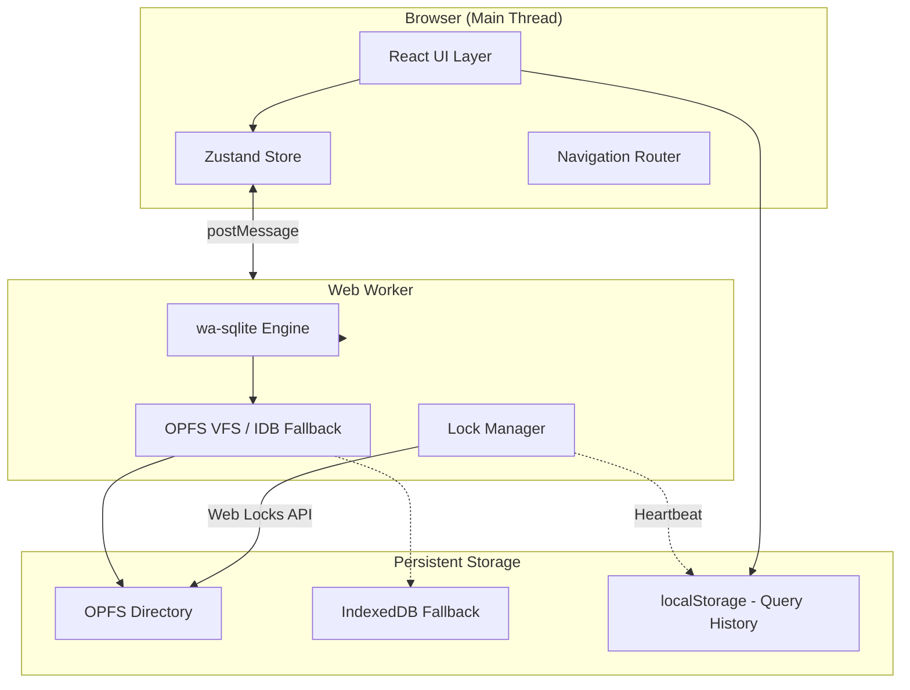

# 03 — Implementation Plan

## Architecture Overview

### System Diagram



### Module Breakdown

| Module | Responsibility | Dependencies |
|--------|---------------|--------------|
| `src/worker/` | SQLite engine, OPFS/IDB VFS, query execution, lock management | wa-sqlite |
| `src/store/` | Global state (Zustand): active DB, sidebar, grid state, lock state | zustand |
| `src/components/sidebar/` | DB list, schema tree, search/filter | React, store |
| `src/components/grid/` | Data grid with virtual scrolling, inline edit | TanStack Table/Virtual |
| `src/components/designer/` | Table designer form, column editor | React, store |
| `src/components/erd/` | ERD canvas, table nodes, FK edges | React Flow |
| `src/components/sql/` | SQL editor with syntax highlighting, autocomplete | CodeMirror 6 |
| `src/components/query-builder/` | Visual query canvas, WHERE builder | React, React Flow |
| `src/components/import/` | CSV/JSON import dialog, preview | PapaParse |
| `src/components/export/` | Export dialogs, format options | — |
| `src/components/common/` | Button, Input, Modal, Toast, ReadOnlyBanner, etc. | Tailwind |
| `src/lib/` | Utilities: SQL generation, validation, rebuild engine | — |

### Data Model

```typescript
// Registry stored in OPFS/IDB
interface DatabaseRegistry {
  v: 1;
  databases: DatabaseEntry[];
}

interface DatabaseEntry {
  name: string;           // Display name
  file: string;           // Filename (e.g., "chinook.sqlite")
  createdAt: string;      // ISO 8601
  lastOpenedAt: string;   // ISO 8601
  fkEnforced: boolean;    // PRAGMA foreign_keys setting
}

// ERD layout metadata (per-database)
interface ERDLayout {
  v: 1;
  tables: Record<string, { x: number; y: number }>;
}

// Worker message protocol
type WorkerRequest =
  | { type: 'open'; dbName: string }
  | { type: 'close' }
  | { type: 'exec'; sql: string; params?: unknown[] }
  | { type: 'query'; sql: string; params?: unknown[]; limit?: number; offset?: number }
  | { type: 'import'; file: File; nameHint: string }  // Streamed in worker; nameHint auto-suffixed on collision
  | { type: 'export'; dbName: string }
  | { type: 'schema' }
  | { type: 'tableInfo'; table: string }
  | { type: 'acquireLock'; dbName: string }
  | { type: 'releaseLock' }
  | { type: 'checkLock'; dbName: string }
  | { type: 'cancel' };  // Interrupt long-running query

type WorkerResponse =
  | { type: 'success'; data?: unknown }
  | { type: 'error'; message: string; code?: 'QUOTA_EXCEEDED' | 'CANCELED' | string }
  | { type: 'progress'; percent: number }
  | { type: 'lockStatus'; isWriter: boolean; holderStale?: boolean }
  | { type: 'storageFull'; dbName: string };  // Quota exceeded notification

// Zustand store shape
interface AppState {
  // Registry
  databases: DatabaseEntry[];
  activeDb: string | null;

  // Schema (for active DB)
  tables: string[];
  views: string[];
  indexes: string[];

  // UI state
  sidebarWidth: number;
  activeTable: string | null;
  activeView: 'grid' | 'designer' | 'sql' | 'query-builder' | 'erd';

  // Unsaved-edit check (navigation guard)
  gridEditInProgress: boolean;         // true while a grid cell is being edited (not yet committed)
  designerDraftInProgress: boolean;    // true when designer has unapplied changes
  erdDraftInProgress: boolean;         // true when FK dialog has unapplied changes
  queryBuilderDraftInProgress: boolean;// true when query builder state would be lost on navigation

  // Persistence status
  storageMode: 'opfs' | 'idb';
  persistenceStatus: 'saved' | 'unsaved' | 'saving' | 'error';
  storageFull: boolean;                // Quota exceeded state

  // Lock state (architectural - set up early)
  isReadOnly: boolean;
  lockHolder: 'self' | 'other' | null;
  lockStale: boolean;  // For heartbeat fallback
}
```

## Key Technical Decisions

### Decision 1: wa-sqlite with OPFS VFS

**Choice**: Use wa-sqlite's `OPFSCoopSyncVFS` for primary storage

**Why**:
- Native OPFS support with synchronous access handles
- SQLite 3.45+ feature baseline (DROP COLUMN, improved ALTER TABLE)
- Transaction-level durability without manual snapshot logic

**Trade-offs**:
- Requires Chromium-based browsers for full OPFS support
- Firefox/Safari fall back to IndexedDB (slower, snapshot-based)

### Decision 2: Lock Infrastructure First

**Choice**: Implement Web Locks + heartbeat fallback in Sprint 2, before any UI editing features

**Why**:
- Multi-tab locking affects every write operation
- Building lock-awareness into the architecture from the start avoids retrofitting
- All editing components can check `isReadOnly` from day one

**Trade-offs**:
- Slightly more complex Sprint 2
- Worth it to avoid touching 50+ locations later

### Decision 3: Single-DB-at-a-time Model

**Choice**: Only one database loaded into wa-sqlite engine at a time

**Why**:
- Simpler memory management
- Clear ownership for Web Locks
- Avoids complex connection pooling

### Decision 4: TanStack Table + Virtual for Data Grid

**Choice**: TanStack Table (headless) + TanStack Virtual for scrolling

**Why**:
- Handles 100k+ rows with virtual scrolling
- Headless = full styling control with Tailwind
- Sorting/filtering are SQL-backed (not in-memory)

### Decision 5: Tests Written Per-Sprint

**Choice**: E2E infrastructure in Sprint 1; each sprint adds its own E2E tests

**Why**:
- Tests validate demoable functionality immediately
- Catches regressions early
- No "test sprint" at the end

## Risks & Mitigations

| Risk | Likelihood | Impact | Mitigation |
|------|------------|--------|------------|
| OPFS unavailable in target browser | Medium | High | IndexedDB fallback with clear banner; test matrix includes Firefox/Safari |
| Large DB (>50MB) causes memory pressure in IDB mode | Medium | Medium | Size warnings; recommend OPFS-capable browsers |
| Table rebuild corrupts data | Low | Critical | Transactional rollback; post-rebuild compile-check; E2E tests |
| Multi-tab race conditions | Medium | High | Web Locks as primary; heartbeat fallback; SQLITE_OPEN_READONLY backstop |
| wa-sqlite WASM load time | Low | Medium | Precache in SW; show loading spinner |

## Sprint Plan

---

### Sprint 1: Foundation + Test Infrastructure
**Demo:** Dev server runs, worker responds to ping, E2E smoke test passes
**Verification:** `npm run dev` + `npm run test` + `npm run test:e2e` all pass

#### Tasks:

- [ ] setup, core :: Initialize Vite + React + TypeScript project
  - **ID:** S1-T1
  - **Deliverable:** package.json, tsconfig.json, vite.config.ts, index.html, src/main.tsx
  - **Allowed paths:** /, src/main.tsx, src/App.tsx
  - **Verification:** `npm run dev` starts; browser shows "SQLite Editor" heading

- [ ] setup, tailwind :: Configure Tailwind CSS with design tokens
  - **ID:** S1-T2
  - **Blocked by:** S1-T1
  - **Deliverable:** tailwind.config.js, src/index.css with custom colors/fonts
  - **Allowed paths:** tailwind.config.js, src/index.css, postcss.config.js
  - **Verification:** Custom navy/amber colors render; Inter font loads

- [ ] setup, vitest :: Set up Vitest + Testing Library
  - **ID:** S1-T3
  - **Blocked by:** S1-T1
  - **Deliverable:** vitest.config.ts, src/setupTests.ts, first passing unit test
  - **Allowed paths:** vitest.config.ts, src/setupTests.ts, src/**/*.test.ts
  - **Verification:** `npm run test` passes

- [ ] setup, playwright :: Set up Playwright E2E infrastructure
  - **ID:** S1-T4
  - **Blocked by:** S1-T1
  - **Deliverable:** playwright.config.ts, e2e/smoke.spec.ts (app loads)
  - **Allowed paths:** playwright.config.ts, e2e/*
  - **Verification:** `npm run test:e2e` passes smoke test

- [ ] types, core :: Define TypeScript interfaces
  - **ID:** S1-T5
  - **Blocked by:** S1-T1
  - **Deliverable:** src/types/index.ts with all core interfaces (registry, worker protocol, store)
  - **Allowed paths:** src/types/*
  - **Verification:** `npm run typecheck` passes

- [ ] worker, shell :: Create Web Worker entry point with ping/pong
  - **ID:** S1-T6
  - **Blocked by:** S1-T5
  - **Deliverable:** src/worker/index.ts, worker build config, ping handler
  - **Allowed paths:** src/worker/*, vite.config.ts
  - **Verification:** Worker loads; responds to ping message

- [ ] ui, layout :: Create main app shell layout
  - **ID:** S1-T7
  - **Blocked by:** S1-T2
  - **Deliverable:** src/components/layout/AppShell.tsx (header, sidebar placeholder, main, status bar)
  - **Allowed paths:** src/components/layout/*
  - **Verification:** Three-panel layout renders; styled per design

- [ ] ci, basic :: Add minimal GitHub Actions CI (lint/typecheck/unit)
  - **ID:** S1-T8
  - **Blocked by:** S1-T3
  - **Deliverable:** .github/workflows/ci.yml running npm ci, lint, typecheck, and vitest (no Playwright yet)
  - **Allowed paths:** .github/workflows/*
  - **Verification:** Push to PR triggers CI and basic checks pass

---

### Sprint 2: SQLite Engine + Persistence + Lock Primitives
**Demo:** Create DB via console, persists across refresh; second tab shows "locked"
**Verification:** Data persists; Web Locks prevent concurrent write

#### Tasks:

- [ ] worker, sqlite :: Integrate wa-sqlite WASM engine
  - **ID:** S2-T1
  - **Blocked by:** S1-T6
  - **Deliverable:** wa-sqlite dependency, WASM loading, basic exec/query handlers
  - **Allowed paths:** src/worker/*, package.json
  - **Verification:** `SELECT 1+1` returns 2; unit tests pass

- [ ] worker, opfs :: Implement OPFS VFS integration
  - **ID:** S2-T2
  - **Blocked by:** S2-T1
  - **Deliverable:** OPFS directory setup, OPFSCoopSyncVFS initialization
  - **Allowed paths:** src/worker/*
  - **Verification:** Create DB, insert row, close, reopen → row persists

- [ ] worker, idb :: Implement IndexedDB fallback with persistence contract
  - **ID:** S2-T3
  - **Blocked by:** S2-T1
  - **Deliverable:** IDB stores + persistence contract:
    - serialize/deserialize snapshots (sqlite3_serialize/sqlite3_deserialize)
    - 500ms debounced snapshot after each SQLite write
    - flush-on-close + visibilitychange(hidden)
    - retry on snapshot failure (3 attempts with 1s/2s/4s backoff) and emit 'persistenceDegraded' after retries exhausted
    - fallback detection logic (OPFS unavailable → IDB)
  - **Allowed paths:** src/worker/*
  - **Verification:** Unit tests: debounce + flush works; failure retries/backoff; data persists via IDB across refresh

- [ ] worker, registry :: Implement database registry management
  - **ID:** S2-T4
  - **Blocked by:** S2-T2, S2-T3
  - **Deliverable:** registry.json CRUD, self-heal on corruption
  - **Allowed paths:** src/worker/*
  - **Verification:** Create 2 DBs, refresh page, both appear in registry

- [ ] worker, locks :: Implement Web Locks for single-writer
  - **ID:** S2-T5
  - **Blocked by:** S2-T4
  - **Deliverable:** Lock acquisition on DB open, release on close, lock status reporting
  - **Allowed paths:** src/worker/*
  - **Verification:** Open DB in tab A; tab B cannot acquire lock; status reports correctly

- [ ] worker, heartbeat :: Implement localStorage heartbeat fallback
  - **ID:** S2-T6
  - **Blocked by:** S2-T5
  - **Deliverable:** Heartbeat write every 2s, stale detection at 10s, fallback when Web Locks unavailable
  - **Allowed paths:** src/worker/*, src/lib/heartbeat.ts
  - **Verification:** Unit test: without Web Locks, heartbeat fallback engages

- [ ] lib, worker-client :: Create main-thread worker client
  - **ID:** S2-T7
  - **Blocked by:** S2-T1
  - **Deliverable:** src/lib/worker-client.ts with typed request/response, lock methods
  - **Allowed paths:** src/lib/worker-client.ts
  - **Verification:** Main thread can call worker and receive typed responses

- [ ] tests, e2e-persistence :: E2E test for persistence
  - **ID:** S2-T8
  - **Blocked by:** S2-T4, S1-T4
  - **Deliverable:** e2e/persistence.spec.ts (create DB, refresh, DB exists)
  - **Allowed paths:** e2e/*
  - **Verification:** E2E test passes

- [ ] worker, schema :: Implement schema introspection handlers
  - **ID:** S2-T9
  - **Blocked by:** S2-T1
  - **Deliverable:** Worker handlers for {type:'schema'} and {type:'tableInfo'} returning tables/views/indexes + column metadata (PRAGMA table_info, table_xinfo, index_list)
  - **Allowed paths:** src/worker/*
  - **Verification:** Open DB → schema response includes expected tables/views/indexes; tableInfo returns correct columns including generated column info

- [ ] worker, quota :: Detect quota exceeded and standardize error handling
  - **ID:** S2-T10
  - **Blocked by:** S2-T2, S2-T3
  - **Deliverable:** Map OPFS/IndexedDB QuotaExceededError + SQLite SQLITE_FULL/IOERR into WorkerResponse error code 'QUOTA_EXCEEDED' and expose a 'storageFull' flag for the active DB
  - **Allowed paths:** src/worker/*
  - **Verification:** Inject QuotaExceededError → worker returns code 'QUOTA_EXCEEDED' and DB enters write-block state

- [ ] worker, idb-switch :: Implement IndexedDB switch/close contract
  - **ID:** S2-T11
  - **Blocked by:** S2-T3
  - **Deliverable:** Explicit worker API to flush pending snapshot and await IDB tx commit before disposing in-memory DB; returns error after retries for UI prompt
  - **Allowed paths:** src/worker/*
  - **Verification:** In IDB mode, switching DB waits for snapshot commit; injected failures surface a deterministic error for the 'switch anyway' prompt

---

### Sprint 3: State Management + Sidebar + Lock UI
**Demo:** Sidebar shows DB list; open in two tabs, second shows "Read Only" banner
**Verification:** Sidebar renders; lock status visible in UI

#### Tasks:

- [ ] store, setup :: Create Zustand store with lock state
  - **ID:** S3-T1
  - **Blocked by:** S1-T5, S2-T7
  - **Deliverable:** src/store/index.ts with initial state including isReadOnly, lockHolder
  - **Allowed paths:** src/store/*
  - **Verification:** Store initializes; lock state accessible

- [ ] store, db :: Implement database state actions
  - **ID:** S3-T2
  - **Blocked by:** S3-T1
  - **Deliverable:** Actions: loadRegistry, openDb (with lock), closeDb, createDb, deleteDb (storage-mode aware), renameDb (storage-mode aware), loadSchema (tables/views/indexes) on DB open
  - **Allowed paths:** src/store/*
  - **Verification:** Opening a DB populates tables/views/indexes in store; lock acquired on open

- [ ] ui, readonly-banner :: Implement read-only banner component
  - **ID:** S3-T3
  - **Blocked by:** S3-T1, S1-T7
  - **Deliverable:** src/components/common/ReadOnlyBanner.tsx with Retry, Take Over (when stale)
  - **Allowed paths:** src/components/common/ReadOnlyBanner.tsx
  - **Verification:** Banner renders when isReadOnly; Retry button works

- [ ] ui, sidebar :: Implement sidebar navigator component
  - **ID:** S3-T4
  - **Blocked by:** S3-T2, S1-T7
  - **Deliverable:** src/components/sidebar/Sidebar.tsx, DBTree.tsx, TableItem.tsx
  - **Allowed paths:** src/components/sidebar/*
  - **Verification:** Sidebar renders DB list; clicking DB expands schema tree

- [ ] ui, sidebar-search :: Implement sidebar search/filter
  - **ID:** S3-T5
  - **Blocked by:** S3-T4
  - **Deliverable:** Search input, filtering logic, match highlighting
  - **Allowed paths:** src/components/sidebar/*
  - **Verification:** Type filter text → only matching tables shown; Escape clears

- [ ] ui, sidebar-context :: Implement sidebar context menus
  - **ID:** S3-T6
  - **Blocked by:** S3-T4
  - **Deliverable:** Context menu component, DB actions (rename/delete), table actions (open/design/drop)
  - **Allowed paths:** src/components/sidebar/*, src/components/common/ContextMenu.tsx
  - **Verification:** Right-click DB → menu appears; actions work

- [ ] tests, e2e-multitab :: E2E test for multi-tab locking
  - **ID:** S3-T7
  - **Blocked by:** S3-T3, S1-T4
  - **Deliverable:** e2e/multitab.spec.ts (two tabs, second is read-only)
  - **Allowed paths:** e2e/*
  - **Verification:** E2E test passes with two browser contexts

---

### Sprint 4: Welcome + File Import + Settings
**Demo:** Drop .sqlite file, see tables in sidebar; toggle FK enforcement in settings
**Verification:** Import works; settings persist

#### Tasks:

- [ ] ui, welcome :: Implement welcome/empty state screen
  - **ID:** S4-T1
  - **Blocked by:** S3-T4
  - **Deliverable:** src/components/welcome/Welcome.tsx with drop zone, CTAs
  - **Allowed paths:** src/components/welcome/*
  - **Verification:** Empty registry → welcome screen shown; styled per design

- [ ] ui, dropzone :: Implement file drop zone
  - **ID:** S4-T2
  - **Blocked by:** S4-T1
  - **Deliverable:** Drop zone component, drag-over styling, file type validation
  - **Allowed paths:** src/components/welcome/*, src/components/common/DropZone.tsx
  - **Verification:** Drag .sqlite/.db → zone highlights; drop non-sqlite → error toast (CSV/JSON routed to Import flow)

- [ ] worker, import :: Implement SQLite file import (chunked streaming)
  - **ID:** S4-T3
  - **Blocked by:** S2-T4
  - **Deliverable:** Import pipeline: resolve unique DB name (auto-suffix (1)/(2) on collision) → stream File in worker via file.stream() (1MB chunks) → write to OPFS/IDB, progress events → validate/open via SQLite → on failure, clean up partial artifacts and do NOT modify registry; no full ArrayBuffer allocation
  - **Allowed paths:** src/worker/*
  - **Verification:** Import 10MB file → progress updates → DB opens; importing same file twice auto-suffixes name; invalid/corrupt/encrypted file shows error and leaves registry unchanged

- [ ] ui, import-progress :: Implement import progress UI
  - **ID:** S4-T4
  - **Blocked by:** S4-T3, S4-T2
  - **Deliverable:** Progress bar, cancel button, size warning for >100MB
  - **Allowed paths:** src/components/welcome/*, src/components/common/ProgressBar.tsx
  - **Verification:** Import large file → progress bar shown → can cancel

- [ ] ui, new-db :: Implement "New Database" dialog
  - **ID:** S4-T5
  - **Blocked by:** S3-T2
  - **Deliverable:** Name input with validation, create action
  - **Allowed paths:** src/components/common/*, src/components/welcome/*
  - **Verification:** Create "mydb" → appears in sidebar → empty schema panel shown

- [ ] ui, settings :: Implement settings panel
  - **ID:** S4-T6
  - **Blocked by:** S3-T2
  - **Deliverable:** src/components/settings/SettingsPanel.tsx with storage info, FK toggle
  - **Allowed paths:** src/components/settings/*
  - **Verification:** Toggle FK → PRAGMA foreign_keys changes; persists to registry

- [ ] tests, e2e-import :: E2E test for file import
  - **ID:** S4-T7
  - **Blocked by:** S4-T4, S1-T4
  - **Deliverable:** e2e/import.spec.ts (drop .sqlite, tables appear; invalid file rejected; collision auto-suffix; toolbar file picker works)
  - **Allowed paths:** e2e/*
  - **Verification:** E2E test passes, including registry unchanged after invalid import and unique naming on collisions

- [ ] worker, db-rename :: Implement DB rename (OPFS + IndexedDB fallback)
  - **ID:** S4-T8
  - **Blocked by:** S2-T4
  - **Deliverable:** Worker rename handler updates registry, renames DB file + .erd.json sidecar, and triggers query-history key migration (qh:<old> → qh:<new>)
  - **Allowed paths:** src/worker/*, src/store/*, src/lib/history.ts
  - **Verification:** Rename DB 'a'→'b'; refresh; only 'b' appears; history preserved under new key

- [ ] worker, db-delete :: Implement DB delete + cleanup (OPFS + IndexedDB fallback)
  - **ID:** S4-T9
  - **Blocked by:** S2-T4
  - **Deliverable:** Delete removes DB file, .erd.json sidecar, registry entry, and query-history key (qh:<db>)
  - **Allowed paths:** src/worker/*, src/store/*, src/lib/history.ts
  - **Verification:** Delete DB; refresh; DB absent; no orphaned metadata remains

- [ ] tests, e2e-db-lifecycle :: E2E test for rename/delete persistence
  - **ID:** S4-T10
  - **Blocked by:** S4-T8, S4-T9, S1-T4
  - **Deliverable:** e2e/db-lifecycle.spec.ts (rename persists, delete cleans up, registry consistent after refresh)
  - **Allowed paths:** e2e/*
  - **Verification:** E2E test passes

- [ ] ui, toolbar-open :: Add "Open Database" file picker to workspace toolbar
  - **ID:** S4-T11
  - **Blocked by:** S1-T7, S3-T2
  - **Deliverable:** Toolbar button (Welcome + main workspace) that opens file picker and routes to the same import pipeline as drag-drop
  - **Allowed paths:** src/components/layout/*, src/components/welcome/*
  - **Verification:** With a DB open, use toolbar file picker to import a second DB; both appear in sidebar and new DB becomes active

---

### Sprint 5: Data Grid (Read-Only)
**Demo:** Click table → data grid shows rows with virtual scrolling, sorting, filtering
**Verification:** 100k row table scrolls at 60fps; sort/filter work

#### Tasks:

- [ ] ui, grid-setup :: Set up TanStack Table + Virtual
  - **ID:** S5-T1
  - **Blocked by:** S3-T2
  - **Deliverable:** Dependencies, basic table component shell
  - **Allowed paths:** src/components/grid/*, package.json
  - **Verification:** Grid component renders with hardcoded data

- [ ] worker, query :: Implement paginated query with LIMIT/OFFSET
  - **ID:** S5-T2
  - **Blocked by:** S2-T1
  - **Deliverable:** Query handler with pagination, stable sort tie-breakers (rowid/PK)
  - **Allowed paths:** src/worker/*
  - **Verification:** Query with LIMIT 100 OFFSET 200 returns correct window

- [ ] ui, grid-render :: Implement data grid with virtual scrolling
  - **ID:** S5-T3
  - **Blocked by:** S5-T1, S5-T2
  - **Deliverable:** DataGrid.tsx with column headers, virtual rows, type indicators, generated-column indicator (from PRAGMA table_xinfo)
  - **Allowed paths:** src/components/grid/*
  - **Verification:** 100k row table scrolls smoothly; columns show types; generated columns display indicator

- [ ] ui, grid-sort :: Implement column sorting
  - **ID:** S5-T4
  - **Blocked by:** S5-T3
  - **Deliverable:** Sort state, ORDER BY generation, sort icons in headers
  - **Allowed paths:** src/components/grid/*
  - **Verification:** Click header → sorts ASC; click again → DESC; third → default

- [ ] ui, grid-filter :: Implement column filters
  - **ID:** S5-T5
  - **Blocked by:** S5-T3, S5-T8
  - **Deliverable:** Filter popover, text/numeric/null filters, WHERE generation (shared LIKE-escape util used across grid + query builder)
  - **Allowed paths:** src/components/grid/*
  - **Verification:** Filter Title contains "Rock" → only matching rows shown; special chars %, _, \ escaped correctly

- [ ] ui, grid-null :: Implement NULL and BLOB display styling
  - **ID:** S5-T6
  - **Blocked by:** S5-T3
  - **Deliverable:** NULL as italic gray; BLOB as "[BLOB, N bytes]" placeholder
  - **Allowed paths:** src/components/grid/*
  - **Verification:** NULL visually distinct; BLOB shows size

- [ ] tests, e2e-grid-read :: E2E test for grid reading
  - **ID:** S5-T7
  - **Blocked by:** S5-T5, S1-T4
  - **Deliverable:** e2e/grid-read.spec.ts (open table, sort, filter)
  - **Allowed paths:** e2e/*
  - **Verification:** E2E test passes

- [ ] lib, sql-escape :: Add shared SQL LIKE escaping helper
  - **ID:** S5-T8
  - **Blocked by:** S1-T5
  - **Deliverable:** src/lib/sql-escape.ts with escapeLike(value) and tests (escapes %, _, \; emits ESCAPE '\' compatible strings)
  - **Allowed paths:** src/lib/sql-escape.ts
  - **Verification:** Unit tests: input '%', '_', '\' are escaped correctly

---

### Sprint 6: Data Grid (Editing)
**Demo:** Edit cells inline, add rows, delete rows; unsaved prompt on navigation
**Verification:** Edits persist; read-only mode blocks editing

#### Tasks:

- [ ] ui, grid-edit :: Implement inline cell editing
  - **ID:** S6-T1
  - **Blocked by:** S5-T3
  - **Deliverable:** Edit mode, input/textarea, Enter/Escape handling, read-only guard, generated-column guard (generated columns never enter edit mode and show tooltip)
  - **Allowed paths:** src/components/grid/*
  - **Verification:** Double-click → input appears (unless read-only or generated column); Enter saves; Escape cancels

- [ ] worker, update :: Implement UPDATE with rowid targeting
  - **ID:** S6-T2
  - **Blocked by:** S2-T1
  - **Deliverable:** UPDATE handler using rowid for rowid tables, PK for WITHOUT ROWID
  - **Allowed paths:** src/worker/*
  - **Verification:** Update cell → SELECT shows new value

- [ ] ui, grid-add :: Implement add row functionality
  - **ID:** S6-T3
  - **Blocked by:** S6-T1
  - **Deliverable:** Add row button, DEFAULT VALUES attempt, required-fields fallback, read-only guard
  - **Allowed paths:** src/components/grid/*
  - **Verification:** Add row to table with defaults → succeeds; NOT NULL no default → form appears

- [ ] ui, grid-delete :: Implement delete rows functionality
  - **ID:** S6-T4
  - **Blocked by:** S6-T1
  - **Deliverable:** Row selection checkboxes, delete button, confirmation dialog, read-only guard
  - **Allowed paths:** src/components/grid/*
  - **Verification:** Select 3 rows → Delete → confirm → rows removed

- [ ] ui, grid-context :: Implement cell context menu
  - **ID:** S6-T5
  - **Blocked by:** S6-T1
  - **Deliverable:** Right-click menu: Copy, Set NULL, Save BLOB as file
  - **Allowed paths:** src/components/grid/*
  - **Verification:** Right-click → Set NULL → cell shows NULL; Save BLOB downloads

- [ ] ui, status :: Implement persistence status in status bar
  - **ID:** S6-T6
  - **Blocked by:** S6-T2
  - **Deliverable:** Status bar shows Saved/Unsaved/Saving, storage mode, DB size, row count
  - **Allowed paths:** src/components/layout/StatusBar.tsx
  - **Verification:** Edit cell → "Saved" after commit (OPFS) or "Saving..." → "Saved" (IDB)

- [ ] ui, unsaved-prompt :: Implement unsaved changes prompt
  - **ID:** S6-T7
  - **Blocked by:** S6-T1
  - **Deliverable:** Central Unsaved-Edit Check flow used by: DB switch, table/view open, surface switch (grid/designer/sql/query-builder/erd), file import/open, and beforeunload. Supports:
    - Grid cell edit: Save / Discard / Cancel
    - Draft changes (Designer / ERD FK dialog / Query Builder): Discard draft changes / Cancel
  - **Allowed paths:** src/components/common/UnsavedPrompt.tsx
  - **Verification:** Edit cell → switch DB → prompt appears; designer/qb/erd draft → navigation prompts Discard/Cancel

- [ ] tests, e2e-grid-edit :: E2E test for grid editing
  - **ID:** S6-T8
  - **Blocked by:** S6-T4, S1-T4
  - **Deliverable:** e2e/grid-edit.spec.ts (edit, add, delete, persist, generated column read-only)
  - **Allowed paths:** e2e/*
  - **Verification:** E2E test passes; includes attempting to edit a GENERATED column and asserting it remains unchanged and UI blocks edit mode

- [ ] ui, quota-ui :: Implement quota exceeded modal + global write gating
  - **ID:** S6-T9
  - **Blocked by:** S2-T10, S3-T1
  - **Deliverable:** Blocking modal + persistent banner when storageFull; disable all write entry points (grid edits, designer apply, ERD FK apply, imports, SQL DDL/DML) while keeping read-only + export functional
  - **Allowed paths:** src/components/common/*, src/store/*
  - **Verification:** Simulate quota exceeded → modal shown; all write actions blocked; exports still work

- [ ] ui, idb-degraded :: Implement IndexedDB degraded-persistence banner + modal
  - **ID:** S6-T10
  - **Blocked by:** S2-T3, S3-T1
  - **Deliverable:** Persistent red banner + blocking modal after IDB snapshot retries exhausted; offers Export and Retry Save; keeps editing enabled but warns of potential data loss on tab close
  - **Allowed paths:** src/components/common/*, src/store/*
  - **Verification:** Inject IDB write failures → retries happen → banner+modal appear after 3 failures; export remains functional

---

### Sprint 7: SQL Editor
**Demo:** Write SQL, execute, see results; query history persists
**Verification:** Multi-statement with error → rollback works

#### Tasks:

- [ ] ui, sql-setup :: Set up CodeMirror 6 with SQLite syntax
  - **ID:** S7-T1
  - **Blocked by:** S1-T2
  - **Deliverable:** Dependencies, basic editor component
  - **Allowed paths:** src/components/sql/*, package.json
  - **Verification:** Editor renders with syntax highlighting

- [ ] ui, sql-editor :: Implement SQL editor component
  - **ID:** S7-T2
  - **Blocked by:** S7-T1
  - **Deliverable:** SQLEditor.tsx with Run button, Cancel button, Ctrl+Enter shortcut, read-only guard using sqlite3_stmt_readonly() per prepared statement (blocks DML/DDL/write PRAGMAs before execution)
  - **Allowed paths:** src/components/sql/*
  - **Verification:** Type SQL → Ctrl+Enter → query executes; Cancel stops execution; read-only blocks DML

- [ ] worker, multi-stmt :: Implement multi-statement execution
  - **ID:** S7-T3
  - **Blocked by:** S2-T1
  - **Deliverable:** sqlite3_prepare_v2 loop, implicit transaction, rollback on error
  - **Allowed paths:** src/worker/*
  - **Verification:** Multi-statement script with error → all rolled back

- [ ] ui, sql-results :: Implement results display
  - **ID:** S7-T4
  - **Blocked by:** S7-T2, S5-T3
  - **Deliverable:** Results grid (reuse DataGrid), affected row summary, execution time
  - **Allowed paths:** src/components/sql/*
  - **Verification:** SELECT shows grid; INSERT shows "1 row inserted"

- [ ] ui, sql-errors :: Implement error display with line numbers
  - **ID:** S7-T5
  - **Blocked by:** S7-T2
  - **Deliverable:** Error panel with line/column, inline highlight in editor
  - **Allowed paths:** src/components/sql/*
  - **Verification:** Syntax error → error shown with line number

- [ ] ui, sql-history :: Implement query history
  - **ID:** S7-T6
  - **Blocked by:** S7-T2
  - **Deliverable:** History dropdown (last 50), localStorage persistence, clear action
  - **Allowed paths:** src/components/sql/*, src/lib/history.ts
  - **Verification:** Run queries → history dropdown shows them; refresh → still there

- [ ] ui, sql-autocomplete :: Implement schema-aware autocomplete
  - **ID:** S7-T7
  - **Blocked by:** S7-T1, S3-T2
  - **Deliverable:** Autocomplete for table/column names from schema
  - **Allowed paths:** src/components/sql/*
  - **Verification:** Type "SELECT * FROM " → table names suggested

- [ ] tests, e2e-sql :: E2E test for SQL editor
  - **ID:** S7-T8
  - **Blocked by:** S7-T4, S7-T9, S1-T4
  - **Deliverable:** e2e/sql.spec.ts (execute query, multi-statement, error handling, cancel)
  - **Allowed paths:** e2e/*
  - **Verification:** E2E test passes including canceling a long-running query without leaving connection in a transaction

- [ ] worker, interrupt :: Implement query cancellation (sqlite3_interrupt)
  - **ID:** S7-T9
  - **Blocked by:** S7-T3
  - **Deliverable:** Worker supports {type:'cancel'} request; long-running exec/query calls are interruptible and return a 'CANCELED' error code
  - **Allowed paths:** src/worker/*
  - **Verification:** Start a long-running query; send cancel → worker stops execution and returns 'CANCELED' within 1s

---

### Sprint 8: Table Designer
**Demo:** Create new table via designer; add column to existing table
**Verification:** Schema changes persist; read-only blocks apply

#### Tasks:

- [ ] ui, designer-form :: Implement table designer form
  - **ID:** S8-T1
  - **Blocked by:** S3-T2
  - **Deliverable:** TableDesigner.tsx with name input, column list, read-only guard
  - **Allowed paths:** src/components/designer/*
  - **Verification:** Form renders; can add/remove column rows

- [ ] ui, designer-column :: Implement column editor row
  - **ID:** S8-T2
  - **Blocked by:** S8-T1
  - **Deliverable:** ColumnRow.tsx with name, type dropdown, constraint checkboxes, drag reorder
  - **Allowed paths:** src/components/designer/*
  - **Verification:** Can edit column name, select type, toggle PK/NOT NULL

- [ ] lib, ddl :: Implement DDL generation for CREATE TABLE
  - **ID:** S8-T3
  - **Blocked by:** S1-T5
  - **Deliverable:** src/lib/ddl.ts with createTable(), alterTable() SQL generation
  - **Allowed paths:** src/lib/ddl.ts
  - **Verification:** Unit tests: generates valid CREATE TABLE SQL

- [ ] ui, designer-preview :: Implement DDL diff preview
  - **ID:** S8-T4
  - **Blocked by:** S8-T1, S8-T3
  - **Deliverable:** Preview panel showing before/after SQL, affected objects
  - **Allowed paths:** src/components/designer/*
  - **Verification:** Add column → preview shows ALTER TABLE or rebuild diff

- [ ] lib, rebuild-plan :: Table rebuild plan + object capture
  - **ID:** S8-T5a
  - **Blocked by:** S8-T3
  - **Deliverable:** src/lib/rebuild.ts: extract original CREATE TABLE + dependent indexes/triggers/views/fks from sqlite_master and produce a deterministic rebuild plan (no execution yet)
  - **Allowed paths:** src/lib/rebuild.ts
  - **Verification:** Unit test: rebuild plan lists expected objects for fixture table (indexes + triggers present)

- [ ] lib, rebuild-exec :: Execute rebuild transactionally (data copy + recreate objects)
  - **ID:** S8-T5b
  - **Blocked by:** S8-T5a
  - **Deliverable:** src/lib/rebuild.ts: execute plan inside a transaction (create temp table, copy data, swap, recreate indexes/triggers)
  - **Allowed paths:** src/lib/rebuild.ts
  - **Verification:** Rebuild preserves row counts + index_list + trigger existence; rollback on NOT NULL copy failure

- [ ] lib, rebuild-verify :: Guardrails + post-rebuild verification
  - **ID:** S8-T5c
  - **Blocked by:** S8-T5b
  - **Deliverable:** src/lib/rebuild.ts: post-rebuild PRAGMA verification + compile-check all views/triggers; rollback with dependency error on any failure
  - **Allowed paths:** src/lib/rebuild.ts
  - **Verification:** Fixture with dependent view/trigger breaks → transaction rolled back and error lists broken objects

- [ ] worker, schema-ops :: Implement schema modification operations
  - **ID:** S8-T6
  - **Blocked by:** S8-T5c
  - **Deliverable:** Worker handlers for createTable, alterTable, dropTable, dropColumn
  - **Allowed paths:** src/worker/*
  - **Verification:** Create table via worker → PRAGMA table_info returns columns

- [ ] tests, e2e-designer :: E2E test for table designer
  - **ID:** S8-T7
  - **Blocked by:** S8-T6, S1-T4
  - **Deliverable:** e2e/designer.spec.ts (create table, add column, drop column)
  - **Allowed paths:** e2e/*
  - **Verification:** E2E test passes

---

### Sprint 9: ERD View
**Demo:** Open ERD → see all tables with FK connections; drag to reposition
**Verification:** FK lines render correctly; positions persist

#### Tasks:

- [ ] ui, erd-setup :: Set up React Flow
  - **ID:** S9-T1
  - **Blocked by:** S1-T2
  - **Deliverable:** Dependencies, basic canvas component with pan/zoom
  - **Allowed paths:** src/components/erd/*, package.json
  - **Verification:** Empty canvas renders with controls

- [ ] ui, erd-nodes :: Implement table node component
  - **ID:** S9-T2
  - **Blocked by:** S9-T1
  - **Deliverable:** TableNode.tsx showing table name, columns, PK/FK indicators
  - **Allowed paths:** src/components/erd/*
  - **Verification:** Tables render as cards with column list

- [ ] worker, fk-query :: Implement FK relationship query
  - **ID:** S9-T3
  - **Blocked by:** S2-T1
  - **Deliverable:** Query all FKs via PRAGMA foreign_key_list for all tables
  - **Allowed paths:** src/worker/*
  - **Verification:** Returns list of all FK relationships in DB

- [ ] ui, erd-edges :: Implement FK edge rendering
  - **ID:** S9-T4
  - **Blocked by:** S9-T2, S9-T3
  - **Deliverable:** FKEdge.tsx with arrow, ON DELETE/UPDATE labels
  - **Allowed paths:** src/components/erd/*
  - **Verification:** FK edges render with correct connections

- [ ] ui, erd-layout :: Implement layout persistence
  - **ID:** S9-T5
  - **Blocked by:** S9-T2
  - **Deliverable:** Save/load positions to .erd.json, auto-layout for new DBs
  - **Allowed paths:** src/components/erd/*, src/worker/*
  - **Verification:** Drag table → refresh → position preserved

- [ ] ui, erd-create-fk :: Implement FK creation via drag
  - **ID:** S9-T6
  - **Blocked by:** S9-T4, S8-T5c
  - **Deliverable:** Drag column to column, validation dialog, parent uniqueness check, rebuild
  - **Allowed paths:** src/components/erd/*
  - **Verification:** Drag to create FK → FK appears in PRAGMA foreign_key_list

- [ ] ui, erd-edit-fk :: Implement FK edit/delete
  - **ID:** S9-T7
  - **Blocked by:** S9-T6
  - **Deliverable:** Right-click edge → Edit (ON DELETE/UPDATE) / Delete
  - **Allowed paths:** src/components/erd/*
  - **Verification:** Edit FK action → PRAGMA shows updated; delete → FK gone

- [ ] tests, e2e-erd :: E2E test for ERD
  - **ID:** S9-T8
  - **Blocked by:** S9-T6, S1-T4
  - **Deliverable:** e2e/erd.spec.ts (FK count matches, create FK, delete FK)
  - **Allowed paths:** e2e/*
  - **Verification:** E2E test passes

---

### Sprint 10: Query Builder
**Demo:** Add tables, select columns, define join, run query
**Verification:** Generated SQL is deterministic and correct

#### Tasks:

- [ ] ui, qb-canvas :: Implement query builder canvas
  - **ID:** S10-T1
  - **Blocked by:** S9-T1
  - **Deliverable:** QueryBuilder.tsx with table list panel, canvas area
  - **Allowed paths:** src/components/query-builder/*
  - **Verification:** Can add tables to canvas

- [ ] ui, qb-table :: Implement table box with selectable columns
  - **ID:** S10-T2
  - **Blocked by:** S10-T1
  - **Deliverable:** QBTable.tsx with column checkboxes
  - **Allowed paths:** src/components/query-builder/*
  - **Verification:** Check columns → selected for output

- [ ] ui, qb-join :: Implement join creation via drag
  - **ID:** S10-T3
  - **Blocked by:** S10-T2
  - **Deliverable:** Drag between columns → join edge, INNER/LEFT/RIGHT selector
  - **Allowed paths:** src/components/query-builder/*
  - **Verification:** Create INNER JOIN → edge renders with label

- [ ] ui, qb-where :: Implement WHERE condition builder
  - **ID:** S10-T4
  - **Blocked by:** S10-T2, S5-T8
  - **Deliverable:** Condition rows: column, operator, value; LIKE escaping via shared helper (escape %, _, \; emits ESCAPE '\')
  - **Allowed paths:** src/components/query-builder/*
  - **Verification:** Add condition → SQL preview updates; special chars escaped

- [ ] ui, qb-order :: Implement ORDER BY builder
  - **ID:** S10-T8
  - **Blocked by:** S10-T2
  - **Deliverable:** ORDER BY panel (column + ASC/DESC), stored in builder state
  - **Allowed paths:** src/components/query-builder/*
  - **Verification:** Add ORDER BY → SQL preview updates deterministically

- [ ] ui, qb-limit :: Implement LIMIT control
  - **ID:** S10-T9
  - **Blocked by:** S10-T2
  - **Deliverable:** LIMIT input with validation (positive integer), stored in builder state
  - **Allowed paths:** src/components/query-builder/*
  - **Verification:** Set LIMIT 100 → SQL preview includes LIMIT with param 100

- [ ] lib, qb-sql :: Implement SQL generation from builder state
  - **ID:** S10-T5
  - **Blocked by:** S10-T4, S10-T8, S10-T9
  - **Deliverable:** src/lib/query-builder.ts with deterministic SQL output (SELECT/JOIN/WHERE/ORDER BY/LIMIT), aliased columns
  - **Allowed paths:** src/lib/query-builder.ts
  - **Verification:** Unit tests: same state → same SQL; duplicate column names get aliases

- [ ] ui, qb-preview :: Implement live SQL preview and run
  - **ID:** S10-T6
  - **Blocked by:** S10-T5, S7-T4
  - **Deliverable:** SQL preview panel, Run button, results grid
  - **Allowed paths:** src/components/query-builder/*
  - **Verification:** Build query → preview shows SQL → Run → results

- [ ] tests, e2e-qb :: E2E test for query builder
  - **ID:** S10-T7
  - **Blocked by:** S10-T6, S1-T4
  - **Deliverable:** e2e/query-builder.spec.ts (add tables, join, run)
  - **Allowed paths:** e2e/*
  - **Verification:** E2E test passes; asserts generated SQL includes ORDER BY + LIMIT when configured

---

### Sprint 11: Import/Export (CSV/JSON)
**Demo:** Import CSV into new table; export table as CSV and JSON
**Verification:** Round-trip preserves data; errors show row number

#### Tasks:

- [ ] lib, csv :: Implement CSV parsing with PapaParse
  - **ID:** S11-T1
  - **Blocked by:** S1-T1
  - **Deliverable:** src/lib/csv.ts with parse/serialize, header normalization, type inference
  - **Allowed paths:** src/lib/csv.ts, package.json
  - **Verification:** Parse CSV → correct columns and inferred types

- [ ] lib, json :: Implement JSON parsing for import
  - **ID:** S11-T2
  - **Blocked by:** S1-T1
  - **Deliverable:** src/lib/json.ts with flat array validation, type inference
  - **Allowed paths:** src/lib/json.ts
  - **Verification:** Parse JSON array → columns extracted; nested rejected

- [ ] ui, import-dialog :: Implement import dialog
  - **ID:** S11-T3
  - **Blocked by:** S4-T2, S11-T1
  - **Deliverable:** ImportDialog.tsx with file picker, format detection, target selector
  - **Allowed paths:** src/components/import/*
  - **Verification:** Select CSV or JSON → dialog opens with preview

- [ ] ui, import-preview :: Implement import preview and type override
  - **ID:** S11-T4
  - **Blocked by:** S11-T3
  - **Deliverable:** Preview grid (10 rows), column type dropdowns, header normalization display
  - **Allowed paths:** src/components/import/*
  - **Verification:** Preview shows data; can change column type

- [ ] worker, import-data :: Implement transactional data import
  - **ID:** S11-T5
  - **Blocked by:** S11-T1, S11-T2
  - **Deliverable:** Worker handler for CSV/JSON import with progress, rollback on error
  - **Allowed paths:** src/worker/*
  - **Verification:** Import 1000 rows → success; constraint violation → 0 rows committed

- [ ] ui, export-dialog :: Implement export dialog
  - **ID:** S11-T6
  - **Blocked by:** S1-T2
  - **Deliverable:** ExportDialog.tsx with format picker, CSV options (spreadsheet-safe toggle)
  - **Allowed paths:** src/components/export/*
  - **Verification:** Export table as CSV → download triggers

- [ ] worker, export :: Implement export handlers
  - **ID:** S11-T7
  - **Blocked by:** S11-T1
  - **Deliverable:** Export DB via VACUUM INTO when possible; on QUOTA_EXCEEDED fall back to sqlite3_backup into in-memory buffer + Blob download; export table/results as CSV/JSON
  - **Allowed paths:** src/worker/*
  - **Verification:** Export DB → valid .sqlite even when quota is exceeded; export CSV → valid CSV with BOM

- [ ] tests, e2e-import-export :: E2E test for import/export
  - **ID:** S11-T8
  - **Blocked by:** S11-T5, S11-T7, S1-T4
  - **Deliverable:** e2e/import-export.spec.ts (import CSV, export, round-trip)
  - **Allowed paths:** e2e/*
  - **Verification:** E2E test passes; includes a forced quota-exceeded run where 'Download Database' still succeeds

---

### Sprint 12: PWA + Polish
**Demo:** App installs as PWA; works offline; keyboard shortcuts work
**Verification:** Lighthouse PWA >= 90; offline E2E passes

#### Tasks:

- [ ] pwa, manifest :: Create web app manifest
  - **ID:** S12-T1
  - **Blocked by:** S1-T1
  - **Deliverable:** manifest.json with icons, name, standalone display mode
  - **Allowed paths:** public/manifest.json, public/icons/*
  - **Verification:** Manifest loads; install prompt appears

- [ ] pwa, sw :: Configure Vite PWA plugin with Workbox
  - **ID:** S12-T2
  - **Blocked by:** S12-T1
  - **Deliverable:** vite-plugin-pwa config, precache all assets including WASM
  - **Allowed paths:** vite.config.ts, package.json
  - **Verification:** Build includes SW; assets precached

- [ ] pwa, offline :: Implement offline fallback screen
  - **ID:** S12-T3
  - **Blocked by:** S12-T2
  - **Deliverable:** Offline screen for uncached first visit, retry button
  - **Allowed paths:** src/components/common/OfflineScreen.tsx, public/offline.html
  - **Verification:** First visit offline → offline screen; cached visit works

- [ ] pwa, update :: Implement SW update notification
  - **ID:** S12-T4
  - **Blocked by:** S12-T2
  - **Deliverable:** Update banner, reload action
  - **Allowed paths:** src/components/common/UpdateBanner.tsx
  - **Verification:** Deploy update → banner appears

- [ ] ui, keyboard :: Implement keyboard shortcuts
  - **ID:** S12-T5
  - **Blocked by:** S7-T2, S6-T1
  - **Deliverable:** Ctrl+Enter (run), Ctrl+S (download), Ctrl+N (new), Escape, F2
  - **Allowed paths:** src/hooks/useKeyboardShortcuts.ts
  - **Verification:** Ctrl+S triggers download; Ctrl+N opens new DB dialog

- [ ] ui, a11y :: Accessibility audit and fixes
  - **ID:** S12-T6
  - **Blocked by:** S5-T3, S3-T4
  - **Deliverable:** ARIA labels, focus management, keyboard navigation, focus indicators
  - **Allowed paths:** src/components/**
  - **Verification:** Tab through entire app; screen reader announces elements

- [ ] tests, e2e-pwa :: E2E test for PWA/offline
  - **ID:** S12-T7
  - **Blocked by:** S12-T3, S1-T4
  - **Deliverable:** e2e/pwa.spec.ts (offline mode, full workflow)
  - **Allowed paths:** e2e/*
  - **Verification:** E2E test passes with network disabled

- [ ] ci, lighthouse :: Add Lighthouse CI check
  - **ID:** S12-T8
  - **Blocked by:** S12-T2
  - **Deliverable:** Lighthouse CI config, PWA >= 90, Performance >= 80
  - **Allowed paths:** .github/workflows/*, lighthouserc.js
  - **Verification:** Lighthouse CI passes

---

### Sprint 13: CI Pipeline + Final Polish
**Demo:** PR triggers full CI; all tests pass; bundle size under limit
**Verification:** `git push` → CI green

#### Tasks:

- [ ] ci, e2e :: Extend CI to run Playwright E2E + artifacts
  - **ID:** S13-T1
  - **Blocked by:** S1-T4, S1-T8
  - **Deliverable:** Update .github/workflows/ci.yml to include Playwright install + e2e run + trace/video artifacts on failure
  - **Allowed paths:** .github/workflows/*
  - **Verification:** PR CI runs E2E in Chromium and uploads traces on failure

- [ ] ci, bundle :: Add bundle size check
  - **ID:** S13-T2
  - **Blocked by:** S13-T1
  - **Deliverable:** Bundle analyzer, size limit config (< 2MB, gzip < 500KB)
  - **Allowed paths:** .github/workflows/*, package.json
  - **Verification:** CI fails if bundle exceeds limit

- [ ] ui, loading :: Implement loading states for long operations
  - **ID:** S13-T3
  - **Blocked by:** S5-T3
  - **Deliverable:** Skeleton loaders for grid, spinner for operations
  - **Allowed paths:** src/components/common/*, src/components/grid/*
  - **Verification:** Large table load shows skeleton; import shows spinner

- [ ] ui, error-boundary :: Implement error boundary and recovery
  - **ID:** S13-T4
  - **Blocked by:** S1-T7
  - **Deliverable:** ErrorBoundary component, worker crash recovery UI
  - **Allowed paths:** src/components/common/ErrorBoundary.tsx
  - **Verification:** Simulate error → boundary catches → recovery option shown

- [ ] ui, confirm-destructive :: Implement confirmation for destructive operations
  - **ID:** S13-T5
  - **Blocked by:** S3-T6
  - **Deliverable:** Confirmation dialogs for DROP TABLE, DROP COLUMN, DELETE DB
  - **Allowed paths:** src/components/common/ConfirmDialog.tsx
  - **Verification:** DROP TABLE via sidebar → confirm dialog appears

- [ ] docs, readme :: Write user-facing README
  - **ID:** S13-T6
  - **Blocked by:** S12-T1
  - **Deliverable:** README.md with features, screenshots, usage
  - **Allowed paths:** README.md
  - **Verification:** README renders correctly on GitHub

- [ ] tests, perf-suite :: Add Playwright perf regression suite (Chromium-only)
  - **ID:** S13-T7
  - **Blocked by:** S5-T3, S4-T3
  - **Deliverable:** e2e/perf/*.spec.ts measuring: 100k grid scroll frame time, 100MB import time, peak heap via CDP, query-start latency; emits JSON metrics + trace artifacts
  - **Allowed paths:** e2e/perf/*, scripts/*
  - **Verification:** Perf tests produce metric artifacts and fail when gates regress beyond thresholds

---

## Verification Plan

### Local Development
```bash
npm install
npm run dev
# Open http://localhost:5173
```

### Test Commands
```bash
npm run test        # Unit tests (Vitest)
npm run test:e2e    # E2E tests (Playwright)
npm run typecheck   # TypeScript
npm run lint        # ESLint
```

### Minimum E2E Flows (covered by E2E tests)
1. [x] Drop .sqlite file and see tables (S4-T7)
2. [x] Data persists across reload (S2-T8)
3. [x] Multi-tab shows read-only (S3-T7)
4. [x] Browse and sort/filter data (S5-T7)
5. [x] Edit cells, add/delete rows (S6-T8)
6. [x] Run SQL queries (S7-T8)
7. [x] Create table via designer (S8-T7)
8. [x] See/create FK in ERD (S9-T8)
9. [x] Build query visually (S10-T7)
10. [x] Import CSV, export data (S11-T8)
11. [x] PWA works offline (S12-T7)

### Performance Gates
- [ ] 1MB .sqlite loads in < 10s (cold)
- [ ] 100MB .sqlite loads in < 60s with peak heap < 250MB
- [ ] 100k row table scrolls at 60fps
- [ ] Query execution starts in < 100ms

### Quality Gates
- [ ] TypeScript compiles without errors
- [ ] ESLint passes
- [ ] All unit tests pass
- [ ] All E2E tests pass
- [ ] Lighthouse PWA >= 90
- [ ] Lighthouse Performance >= 80
- [ ] Bundle size < 2MB (gzip < 500KB)

## Rollout Plan

### Deployment
- Static hosting (Vercel, Netlify, GitHub Pages)
- No backend required

### Monitoring
- Console error logging (no external telemetry)
- Performance marks for key operations (dev tools only)

### Rollback
- Revert to previous deployment (instant for static hosting)

## Summary

| Metric | Value |
|--------|-------|
| **Sprints** | 13 |
| **Total tasks** | 113 |
| **E2E test tasks** | 12 (one per sprint after S1 + db-lifecycle) |
| **Avg tasks/sprint** | ~9 |

## Critical Path

1. Foundation + worker boot (S1-T1 → S1-T6)
2. Persistence + registry + locks + schema introspection (S2-T1 → S2-T11)
3. DB open/switch + schema load + sidebar (S3-T1 → S3-T4)
4. Import pipeline + DB lifecycle (S4-T1 → S4-T11)
5. Grid read + query windowing (S5-T1 → S5-T8)
6. Grid write path + status/unsaved prompt + quota UI (S6-T1 → S6-T10)
7. SQL editor multi-statement + results + cancel (S7-T1 → S7-T9)
8. Rebuild engine (plan/exec/verify) + schema ops (S8-T3 → S8-T6)
9. ERD FK mutations (S9-T3 → S9-T7)

## Estimation Buffer

- Reserve ~15% capacity per sprint for integration/bugfixes (especially S2, S6, S8, S9)
- Treat the rebuild engine + IDB snapshot persistence as the primary unknowns
- Plan an explicit hardening pass before Sprint 9 starts

### Sprint Progression

| Sprint | Focus | Key Demo |
|--------|-------|----------|
| 1 | Foundation + Test Infra | Dev server + E2E smoke |
| 2 | SQLite + Persistence + Locks | DB persists, lock works |
| 3 | State + Sidebar + Lock UI | Sidebar + read-only banner |
| 4 | Welcome + Import + Settings | Drop .sqlite, settings |
| 5 | Data Grid (Read) | Virtual scroll, sort, filter |
| 6 | Data Grid (Edit) | Inline edit, add/delete |
| 7 | SQL Editor | Execute queries |
| 8 | Table Designer | Create/modify tables |
| 9 | ERD View | FK visualization |
| 10 | Query Builder | Visual queries |
| 11 | Import/Export | CSV/JSON |
| 12 | PWA + Polish | Offline, a11y |
| 13 | CI + Final Polish | Full pipeline |

## Open Questions

None — all architectural decisions resolved.
