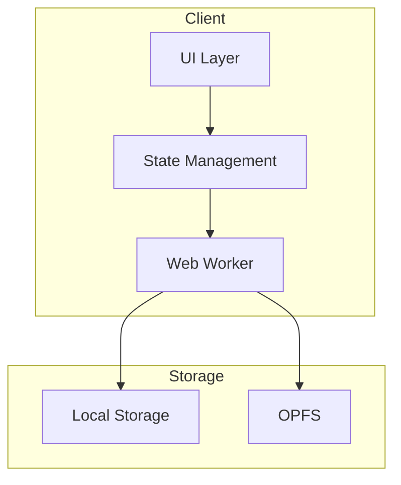

# /plan — Generate Implementation Plan (artifact 03)

## Goal
Generate `artifacts/03-plan.md` with architecture, risks, and task seeds organized into **demoable sprints**.

## CRITICAL: Multi-Model Planning (Doodlestein Method)

For the highest quality plans, use multiple models in sequence:

1. **ChatGPT Pro Extended Thinking** → Creative initial plan
2. **Claude Opus** → Critical review and enhancement  
3. **ChatGPT Pro** → Final synthesis
4. **Iterate 4-5 times** → Until suggestions become incremental

See `skills/phase-transitions/SKILL.md` for exact prompts.

> "After four or five rounds of this, you tend to reach a steady-state where the suggestions become very incremental."

## Prerequisites
- `artifacts/01-prd.md` must exist
- `artifacts/02-ux.md` must exist
- Recommended: Oracle reviews completed for PRD and UX

## Inputs
- `artifacts/01-prd.md`
- `artifacts/02-ux.md`
- Optional: `artifacts/05-design/keystone.html`

## Output
- `artifacts/03-plan.md`

## Steps

### 1. Validate prerequisites
```bash
for f in artifacts/01-prd.md artifacts/02-ux.md; do
  if [ ! -f "$f" ]; then
    echo "Missing: $f"
    exit 1
  fi
done
```

### 2. Analyze requirements
Read PRD and UX to understand:
- Data models needed
- API contracts (if any)
- Component boundaries
- State management approach
- Third-party dependencies

### 3. Generate implementation plan

**CRITICAL: Organize tasks into SPRINTS**

Each sprint must be:
- **Demoable**: Something can be shown working after completion
- **Buildable**: Can be built on previous sprint's output
- **Testable**: Has clear verification criteria

Create `artifacts/03-plan.md`:

````markdown
# 03 — Implementation Plan

## Architecture Overview

### System Diagram


### Modules/Components
| Module | Responsibility | Dependencies |
|--------|---------------|--------------|
| … | … | … |

### Data Model
```typescript
interface Entity {
  id: string;
  // ...
}
```

### API Contracts (if any)
- `POST /api/...` — …
- `GET /api/...` — …

### Worker Boundaries (if any)
- Main thread: UI rendering, user input
- Worker: Heavy computation, file I/O

## Key Technical Decisions

### Decision 1: [Topic]
**Choice**: …
**Why**: …
**Alternatives considered**: …
**Trade-offs**: …

### Decision 2: [Topic]
…

## Risks & Mitigations

| Risk | Likelihood | Impact | Mitigation |
|------|------------|--------|------------|
| … | Medium | High | … |

## Sprint Plan

### Sprint 1: Foundation
**Demo:** Project builds and runs, shows empty shell
**Estimate:** 2-4 hours

#### Tasks:
- [ ] setup, core :: Initialize project structure
  - **ID:** S1-T1
  - **Deliverable:** package.json, tsconfig.json, vite.config.ts
  - **Allowed paths:** /, src/
  - **Verification:** `npm run dev` starts without errors

- [ ] types, core :: Define core data types
  - **ID:** S1-T2
  - **Blocked by:** S1-T1
  - **Deliverable:** src/types/index.ts
  - **Allowed paths:** src/types/*
  - **Verification:** `npm run typecheck` passes

- [ ] tests, setup :: Set up testing infrastructure
  - **ID:** S1-T3
  - **Blocked by:** S1-T1
  - **Deliverable:** vitest.config.ts, first test
  - **Allowed paths:** vitest.config.ts, src/**/*.test.ts
  - **Verification:** `npm run test` passes

### Sprint 2: Core Logic
**Demo:** Core functionality works (no UI yet)
**Estimate:** 4-8 hours

#### Tasks:
- [ ] engine, core :: Implement core module
  - **ID:** S2-T1
  - **Blocked by:** S1-T2
  - **Deliverable:** src/core/index.ts with main logic
  - **Allowed paths:** src/core/*
  - **Verification:** Unit tests pass

- [ ] worker, init :: Set up web worker (if needed)
  - **ID:** S2-T2
  - **Blocked by:** S1-T2
  - **Deliverable:** src/worker/index.ts
  - **Allowed paths:** src/worker/*
  - **Verification:** Worker responds to ping

### Sprint 3: Basic UI
**Demo:** User can see and interact with basic UI
**Estimate:** 4-8 hours

#### Tasks:
- [ ] ui, components :: Create base components
  - **ID:** S3-T1
  - **Blocked by:** S2-T1
  - **Deliverable:** src/components/{Button,Card,Input}.tsx
  - **Allowed paths:** src/components/*
  - **Verification:** Components render in Storybook

- [ ] ui, layout :: Implement main layout
  - **ID:** S3-T2
  - **Blocked by:** S3-T1
  - **Deliverable:** src/layouts/MainLayout.tsx
  - **Allowed paths:** src/layouts/*
  - **Verification:** Layout renders correctly

### Sprint 4: Integration
**Demo:** Full feature works end-to-end
**Estimate:** 4-8 hours

#### Tasks:
- [ ] integration :: Wire up UI to core
  - **ID:** S4-T1
  - **Blocked by:** S3-T2, S2-T1
  - **Deliverable:** Connected components
  - **Allowed paths:** src/**
  - **Verification:** E2E test passes

- [ ] tests, e2e :: Add E2E tests
  - **ID:** S4-T2
  - **Blocked by:** S4-T1
  - **Deliverable:** playwright.config.ts, e2e/*.spec.ts
  - **Allowed paths:** e2e/*, playwright.config.ts
  - **Verification:** `npm run test:e2e` passes

## Verification Plan

### Local Development
```bash
npm install
npm run dev
# Open http://localhost:5173
```

### Minimum E2E Flows
1. [ ] User can [primary action]
2. [ ] User can [secondary action]
3. [ ] Error states display correctly
4. [ ] Data persists across reload

### Regression Checklist
- [ ] All unit tests pass
- [ ] All E2E tests pass
- [ ] No console errors
- [ ] Lighthouse score > 90
- [ ] Bundle size < X KB

## Rollout Plan

### Feature Flags
- `FF_NEW_FEATURE`: Enable new feature (default: false)

### Monitoring
- Error rate: < 0.1%
- P95 latency: < 200ms

### Rollback
1. Disable feature flag
2. If critical: revert deployment

## Open Questions
- …
````

### 4. Self-Review Step (CRITICAL)

After generating the plan, invoke self-review:

```
Review this plan critically:

1. Are all tasks truly ATOMIC (completable in 1-4 hours)?
2. Is each sprint DEMOABLE on its own?
3. Are dependencies correctly identified?
4. Are verification steps CONCRETE and testable?
5. Are there any gaps or missing tasks?
6. Is the ordering optimal for parallel work?

If issues found, fix them before saving.
```

### 5. Ensure task seeds are right-sized
Each task should be:
- Completable in < 4 hours
- Have clear deliverables
- Have explicit verification commands
- Have scoped allowed paths
- Have explicit ID for dependency tracking

### 6. Save
Write to `artifacts/03-plan.md`.

## Next step
Tell user: "Implementation plan generated. Run `/oracle plan` to review with GPT-5.2 Pro."

**IMPORTANT:** Oracle review should be run multiple times until issues converge to zero.
