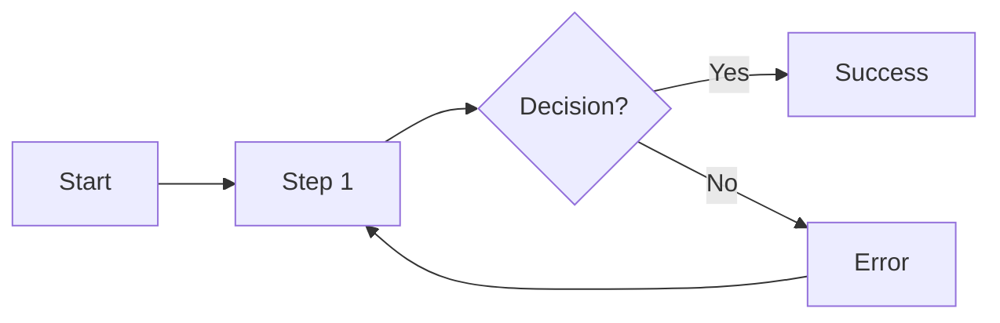

# /ux — Generate UX Spec (artifact 02)

## Goal
Generate `artifacts/02-ux.md` with flows, states, and interaction details.

## Prerequisites
- `artifacts/01-prd.md` must exist
- Recommended: `artifacts/06-oracle/prd/issues.json` (PRD reviewed)

## Inputs
- `artifacts/01-prd.md`
- Optional: `artifacts/05-design/tasteboard.md` (if UI exploration done)

## Output
- `artifacts/02-ux.md`

## Steps

### 1. Validate prerequisites
```bash
if [ ! -f artifacts/01-prd.md ]; then
  echo "Missing PRD. Run /prd first."
  exit 1
fi
```

### 2. Check for unresolved PRD issues
```bash
if [ -f artifacts/06-oracle/prd/issues.json ]; then
  blockers=$(cat artifacts/06-oracle/prd/issues.json | jq '[.issues[] | select(.severity == "blocker")] | length')
  if [ "$blockers" -gt 0 ]; then
    echo "Warning: $blockers blocker issues in PRD. Consider fixing before UX."
  fi
fi
```

### 3. Extract user stories from PRD
Read `artifacts/01-prd.md` and list all user stories.

### 4. Generate UX spec
Create `artifacts/02-ux.md`:

````markdown
# 02 — UX Spec (Flows + State)

## Design Direction
- **Principles**: 
  1. …
  2. …
  3. …
- **Tasteboard link**: artifacts/05-design/tasteboard.md (if exists)

## Primary Flows

### Flow A: [Main user journey]

**Trigger**: User wants to [goal]

**Steps**:
1. User [action] → System [response]
2. User [action] → System [response]
3. …

**Success state**: [What user sees when done]

**Error paths**:
- If [condition] → Show [error], allow [recovery]

**Diagram** (optional):


### Flow B: [Secondary journey]
…

## Screen Inventory

| Screen | Purpose | Entry points |
|--------|---------|--------------|
| Screen 1 | … | … |
| Screen 2 | … | … |

## State Matrix (per screen)

### Screen 1: [Name]

| State | What user sees | Available actions | Telemetry |
|-------|----------------|-------------------|-----------|
| **Loading** | Spinner + "Loading..." | Cancel | `screen1_loading` |
| **Empty** | Empty state illustration + CTA | [Primary action] | `screen1_empty` |
| **Error (recoverable)** | Error message + Retry button | Retry, Cancel | `screen1_error_recoverable` |
| **Error (fatal)** | Error message + Support link | Contact support | `screen1_error_fatal` |
| **Success** | Content displayed | [All actions] | `screen1_loaded` |
| **Partial** | Some content + loading more | Scroll, Wait | `screen1_partial` |

### Screen 2: [Name]
…

## Validation & Copy Rules

| Field | Validation | Error copy |
|-------|------------|------------|
| Email | RFC 5322 format | "Please enter a valid email address" |
| Password | Min 8 chars, 1 number | "Password must be at least 8 characters with 1 number" |

## Accessibility Expectations

- **Keyboard navigation**: All interactive elements focusable, logical tab order
- **Screen reader**: ARIA labels on icons, live regions for dynamic content
- **Contrast**: WCAG AA minimum (4.5:1 for text)
- **Motion**: Respect `prefers-reduced-motion`

## Responsive Breakpoints

| Breakpoint | Width | Layout changes |
|------------|-------|----------------|
| Mobile | < 640px | Single column, bottom nav |
| Tablet | 640-1024px | Two columns, side nav |
| Desktop | > 1024px | Three columns, top nav |

## Interaction Patterns

- **Loading**: Skeleton screens for content, spinners for actions
- **Errors**: Inline for field validation, toast for async errors
- **Success**: Toast for saves, redirect for creates
- **Confirmation**: Modal for destructive actions

## Open UX Questions
- …
````

### 5. Ensure coverage
Verify every PRD user story maps to:
- At least one flow
- At least one screen
- At least one state matrix entry

### 6. Save
Write to `artifacts/02-ux.md`.

## Next step
Tell user: "UX spec generated. Run `/oracle ux` to review with GPT-5.2 Pro."
