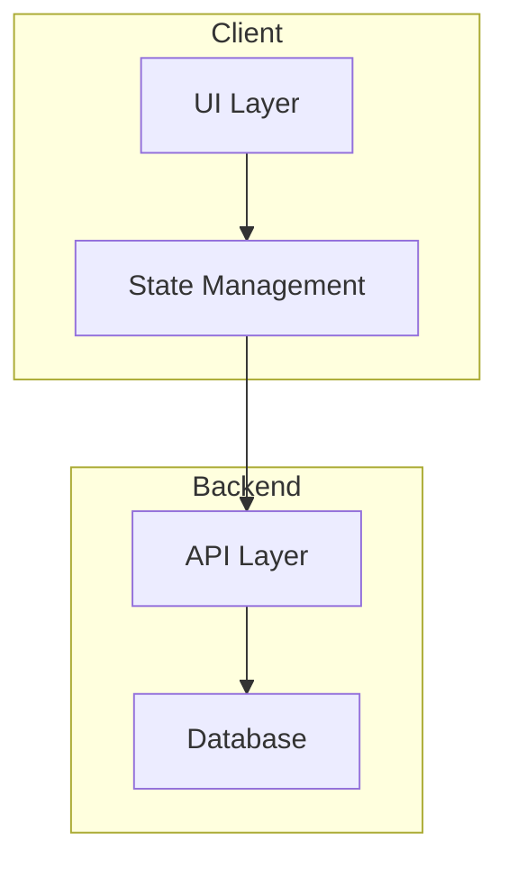

# 03 — Implementation Plan

## Architecture Overview

### System Diagram


### Modules/Components
| Module | Responsibility | Dependencies |
|--------|---------------|--------------|
| … | … | … |

### Data Model
```typescript
interface Entity {
  id: string;
  // ...
}
```

### API Contracts (if any)
- `POST /api/...` — …
- `GET /api/...` — …

## Key Technical Decisions

### Decision 1: [Topic]
- **Choice**: …
- **Why**: …
- **Alternatives**: …
- **Trade-offs**: …

### Decision 2: [Topic]
…

## Risks & Mitigations

| Risk | Likelihood | Impact | Mitigation |
|------|------------|--------|------------|
| … | Medium | High | … |

## Task Seeds

### Task Atomicity Principles (from jdrhyne/planner)

Each task MUST be:
- **Atomic and committable** — small, independent pieces of work
- **Specific and actionable** — not vague
- **Testable** — include verification method
- **Located** — include file paths

**❌ Bad Task:**
- [ ] <auth> :: Implement Google OAuth

**✅ Good Tasks (broken down):**
- [ ] <auth,config> :: Add Google OAuth environment variables
- [ ] <auth,deps> :: Install passport-google-oauth20 package
- [ ] <auth,api> :: Create OAuth callback route handler
- [ ] <auth,ui> :: Add Google sign-in button to login page

### Sprint Structure

Each sprint must:
- Result in a **demoable, runnable, testable increment**
- Build on prior sprint work
- Include **demo/validation checklist**

Use this **exact format** (parsed by task compiler):

### Sprint 1: [Sprint Name]

**Goal**: [What this sprint accomplishes]

**Demo/Validation**:
- [ ] How to run/demo this sprint's output
- [ ] What to verify

**Tasks**:

- [ ] <tag1,tag2> :: Task subject here
      - Description: What needs to be done
      - Deliverable: What artifact is produced
      - Files: src/path/file.ts, src/other/file.ts
      - Allowed paths: src/path/*, src/other/*
      - Verification: npm run test (or other command)
      - Complexity: 1-10 (perceived difficulty)
      - DependsOn: (optional) S1-T1, S1-T2

### Example Sprint:

### Sprint 1: Core Foundation

**Goal**: Setup project structure and core types

**Demo/Validation**:
- [ ] `npm run dev` starts without errors
- [ ] TypeScript compiles with no errors
- [ ] Core types are importable

**Tasks**:

- [ ] <setup,core> :: Initialize project structure
      - Description: Create Vite + React + TypeScript scaffold
      - Deliverable: package.json, tsconfig.json, vite.config.ts
      - Files: package.json, tsconfig.json, vite.config.ts
      - Allowed paths: /
      - Verification: npm run dev starts
      - Complexity: 2

- [ ] <core,types> :: Define core data types
      - Description: Create TypeScript interfaces for database, table, column
      - Deliverable: src/types/index.ts with Database, Table, Column types
      - Files: src/types/index.ts
      - Allowed paths: src/types/*
      - Verification: tsc --noEmit passes
      - Complexity: 3
      - DependsOn: S1-T1

## Verification Plan

### Local Development
```bash
npm install
npm run dev
```

### E2E Flows to Test
1. [ ] User can [primary action]
2. [ ] User can [secondary action]
3. [ ] Error states display correctly

### Regression Checklist
- [ ] All unit tests pass
- [ ] All E2E tests pass
- [ ] No console errors
- [ ] Bundle size < X KB

## Rollout Plan
- **Feature flags**: …
- **Monitoring**: …
- **Rollback**: …

## Open Questions
- …
